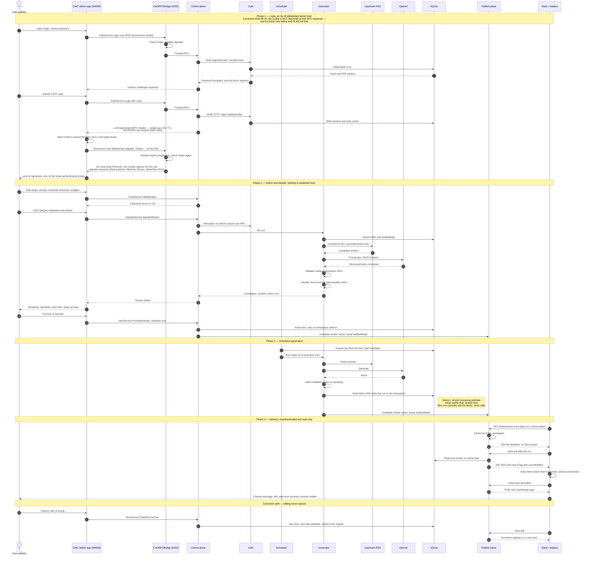

# AnimeFeedFlux — Plan

## 1. The bet

Any RSS reader can subscribe to a feed. Nothing stops that feed from being *written on demand*.
AnimeFeedFlux is a feed **generator**: you declare a recipe ("a daily anime trivia question",
"today's anime news, ranked"), it runs on a schedule, calls an LLM, and publishes the result at a
stable URL as spec-compliant RSS/Atom/JSON Feed. The consumers are Slack and any reader — including
ArticleFlux, which becomes a front end for free.

The product surface is: **a URL that returns valid XML and never lies.**

Two item classes, with different rules. Conflating them is the main way this project fails.

- **Generative** (trivia, fact-of-the-day, "on this day in anime"). The LLM *is* the source.
  Content is authored by us, hosted by us, permalinked to us. Risk = repetition and wrong facts.
- **Grounded** (news, releases, seasonal roundups). The LLM is only an editor. Every link must
  resolve to a real article we fetched ourselves. Risk = hallucinated URLs, handled architecturally
  rather than by prompting.

## 2. Two planes (the architectural spine)

"gRPC, no HTTP" holds for the *application*, but it cannot hold for the feeds themselves — RSS
clients speak HTTP/XML and nothing else. So the system splits in two, and the split is the security
boundary:

| | **Publish plane** | **Control plane** |
|---|---|---|
| Transport | Plain HTTPS, `GET`/`HEAD` only | gRPC over WebSocket (GoGRPCBridge) |
| Payload | RSS 2.0 / Atom 1.0 / JSON Feed 1.1 | protobuf |
| Client | Slack, any feed reader, unauthenticated | GWC WASM admin app, authenticated |
| Host | `anime.earlcameron.com` | `admin.anime.earlcameron.com`, IP-allowlisted |
| Writes | none — structurally impossible | all of them |
| Process | same binary, separate listener + mux | same binary |

There is **no REST/JSON API**. The publish plane serves a fixed route set (§6) and holds a
**read-only** store handle — a `*sql.DB` opened against a connection string with `mode=ro`, wrapped
in a reader interface with no write methods. Everything mutable — recipes, prompts, manual runs,
item edits, the kill switch — is an RPC. A bug in the publish plane cannot corrupt the database
because that code path has no writer, not because we were careful.

One SQLite footgun this creates: a read-only connection to a **WAL** database still needs write
access to the `-shm` wal-index file unless opened `immutable=1`, which is not an option here because
the reader must see new writes. So **boot order is load-bearing** — the writer connection is opened
first and held for process lifetime, which creates `-wal`/`-shm` before the reader attaches.
Otherwise the first cold boot after a fresh deploy (or a crash that removed `-shm`) fails with
"unable to open database file", intermittently and confusingly. Startup asserts this ordering.

### 2.1 End-to-end flow

The whole system in one pass: admin logs in, authors and samples a recipe, the scheduler generates,
and the feed is delivered to Slack. The two planes share nothing but SQLite and one narrow
invalidation call — the publish plane never queries the control plane, and never writes.



Two things the diagram is meant to make obvious. First, the publish plane never calls the control
plane and never writes — it reads SQLite and a cache it does not own, which is why an internet-facing bug cannot
corrupt data. Second, the Slack lane at the bottom is the reason for the `pubDate` discipline in
§5.5: its bookmark advances past anything it has seen, so a backdated item is delivered to nobody.

## 3. Stack

Standard earlcameron shape, so the ops story is boring:

- **UI:** GoWebComponents (pin v5, per the existing `earlcameron` pin) compiled to WASM. Admin only.
- **Transport:** GoGRPCBridge — gRPC-over-WebSocket, so the WASM client speaks real gRPC. The
  primitive is `grpctunnel.BuildBridgeHandler`; `CheckOrigin` and `Authorize` are its pre-upgrade
  hooks.

  **Known caveat, re-verified 2026-08-10 against the pinned `grpctunnel` v1.1.1: grpc-go's own
  keepalive enforcement is INERT, but that is not the whole keepalive story.** The library offers
  `ShouldUseNativeGRPCTransport`, which is what would make grpc-go's own `KeepaliveParams`/
  `EnforcementPolicy` actually apply — but in native mode `grpcServer.Serve` drives the transport
  from a bare `net.Conn` with a listener-level base context, disconnected from the `*http.Request`
  context the validated session is attached to. Session-in-context then never reaches any RPC, which
  breaks §4's per-RPC authentication outright. Handler mode passes the request context through, so
  the session survives. Authentication wins over grpc-go's own flap mitigation: `KeepaliveParams`/
  `EnforcementPolicy` are configured and paired correctly (`internal/bridge/server.go`) but do
  nothing, because grpc-go's enforcement lives in a transport that is not the one serving these
  connections. If that ever needs to be load-bearing, native transport is the thing that must
  change, and session propagation has to be solved first.

  **What actually protects against a vanished peer: `grpctunnel`'s own websocket-level ping/pong,
  not grpc-go's.** `BridgeConfig.PingInterval`/`IdleTimeout` are a separate mechanism, applied
  directly to the `*websocket.Conn` before either transport mode is reached, so they are NOT gated
  by `ShouldUseNativeGRPCTransport`. Left unset (as `internal/bridge` does), they default to a 30s
  server-initiated WebSocket ping and a 120s read deadline reset on each pong. So "a vanished peer
  (laptop sleep, an expired NAT mapping) pins a connection slot forever" is **not** an open problem
  here — it is already handled, just by `grpctunnel`'s ping/pong rather than by the
  `KeepaliveParams`/`EnforcementPolicy` this section used to name as the (inert) mitigation. Those
  two mechanisms answer different questions: grpc-go's `EnforcementPolicy` polices excessive client
  pings on an idle *stream*, `grpctunnel`'s ping/pong detects a dead *socket* — only the first of
  those is inert under handler mode.

  A second mismatch: `Authorize` can only produce `403`, so the session check runs in our own
  handler *before* the bridge is entered, which is what lets a missing session return `401`.

  **Connection limits, added to `internal/bridge`.** `grpctunnel`'s own defaults for
  `MaxActiveConnections`, `MaxConnectionsPerClient` and `MaxUpgradesPerClientPerMinute` are
  **disabled** — an upgrade flood has no ceiling at all unless the caller sets them. `internal/bridge`
  now sets explicit values: `MaxActiveConnections=16`, `MaxConnectionsPerClient=6`,
  `MaxUpgradesPerClientPerMinute=30`. This is admin-only traffic with no uploads (a single admin, a
  handful of tabs/devices at most), on a 2 GB box shared with three other services — so the ceiling
  exists to bound goroutines/websocket buffers/gRPC transport state consumed by a flood of upgrade
  attempts before the process notices anything is wrong, not to model legitimate concurrency, which
  it comfortably exceeds.
- **Backend:** Go, `net/http` for the publish listener, `grpc-go` behind the bridge for control.
- **Store:** SQLite, single file, `WAL`, `busy_timeout=5000`, `foreign_keys=ON`,
  `synchronous=NORMAL`. FTS5 registered (it needs an explicit build tag / registration — a known
  trap) for item search in the admin UI.

  **Driver decided 2026-08-09 (A0-16): `modernc.org/sqlite`, pure Go.** The forcing constraint is
  §15.1: the runtime image is `distroless/static` and the build is `CGO_ENABLED=0`, so a cgo driver
  such as `mattn/go-sqlite3` cannot run there without abandoning the static image. `modernc` is a
  transpilation of SQLite itself, ships FTS5, and needs no cgo. The consequence for §15's systemd
  note is that `MemoryDenyWriteExecute` could safely be `yes` — unlike ArticleFlux, which uses a
  wazero-backed driver that JIT-compiles to executable pages — but the deployment is a container
  now, so that setting is moot and recorded only so the reasoning is not lost. Revisit only if a
  measured query-performance problem appears; correctness and image shape come first.
- **LLM:** **SchemaFlux** — pinned at `github.com/monstercameron/schemaflux v1.1.0`, added 2026-08-10
  (A0-03), which pulls `sashabaranov/go-openai v1.20.4` transitively — the in-house typed-LLM
  library. Feeds are generated with `Generating[T]`, which returns a typed Go value instead of text
  to parse, with retries, structured-output contracts, cost tracking, and telemetry centralized in
  the library. Provider is OpenAI. See §8 for what it does and does not remove from this design.

### Layout

```
proto/aff/v1/            auth, feed, item, run, sample, system  (buf → gen/)
cmd/animefeedflux/       server: publish listener + bridge listener + scheduler
cmd/aff/                 CLI (gRPC client — same API as the UI, no back door)
internal/auth/           argon2id, sessions, TOTP, recovery codes, rate limiting
internal/config/         env parsing + validation, one struct, no globals
internal/store/          SQLite schema, migrations, reader/writer split, FTS5
internal/feedspec/       recipe validation, prompt templates, cron+timezone
internal/llm/            thin adapter over SchemaFlux: typed ops, cost capture, error mapping
internal/generate/       generators: trivia, fact, onthisday, news
internal/sources/        upstream feed fetch, parse, conditional GET, URL verification
internal/render/         RSS 2.0 / Atom 1.0 / JSON Feed 1.1 serializers + permalink HTML
internal/scheduler/      cron loop, single-flight, injectable clock
internal/publish/        the read-only HTTP plane + render cache
internal/rpc/            gRPC service implementations + auth interceptor
internal/obs/            structured logging, metrics, staleness watchdog
web/                     GWC admin app (WASM) + shell
migrations/              NNNN_name.sql, forward-only
testdata/                golden feeds, canned LLM responses, canned upstream RSS
deploy/                  compose.yaml, nginx vhosts, env templates (no secrets)
.github/workflows/       build → test → push to GHCR → deploy over SSH (§15.3)
Dockerfile               multi-stage; distroless static nonroot runtime
.dockerignore
```

## 4. Security and authn

Single human user, who is the admin. **No authorization model** — one role, everything or nothing.
That makes authentication the entire defense, so it gets built properly rather than sketched.

**No JWTs, no OAuth, no bearer tokens — deliberately.** Those solve a problem this system does not
have: letting independent services validate claims without consulting the session authority. There
is one backend and one admin here, so a server-side opaque session is the simpler tool and it makes
logout *immediate* rather than "immediate once the token expires". Nothing to introspect, no
denylist, no JWKS, no rotation machinery, and no signing key to leak. If third-party identity is
ever required, that is the point to revisit — not before.

- **Credential:** password hashed with **argon2id** (not bcrypt — no 72-byte truncation, memory-hard
  params tunable), stored in SQLite. Verification is constant-time. No default password; the account
  is created by `aff admin init`, reading from stdin.

  | Parameter | Value | Why |
  |---|---|---|
  | memory | 64 MiB | Above OWASP's 19 MiB floor; benchmark before raising |
  | iterations | 3 | |
  | parallelism | **1** | OWASP's recommendation for the 19 MiB-class profile |
  | salt | 16 random bytes, per credential, from the OS CSPRNG | |
  | output | 32 bytes | |

  The salt is **not secret** and lives beside the hash. It must never be derived from anything —
  not the user id, not the email, not a constant — because the whole point is that two identical
  passwords produce different hashes.

  **Parameters and a `password_version` travel with the hash**, so cost can be raised later and the
  credential rehashed on next successful login. A hash whose cost is not recorded cannot be migrated
  without locking the only admin out.

- **Pepper (optional, defence in depth):** `HMAC-SHA256(pepper, argon2idOutput)` before storage,
  with the 256-bit pepper held **outside the database** in the environment, and a `pepper_version`
  column from day one so rotation is possible at all. This is what makes a stolen database file
  insufficient on its own: it yields the salt, the parameters and the hash, but not the pepper.
  It is genuinely optional — the design is sound without it — and the cost is rotation complexity,
  which is why the version column exists before it is needed rather than after.

- **Password policy follows NIST SP 800-63B, which means it looks unfamiliar:** 15–128 characters,
  spaces and Unicode allowed, **no mandatory composition rules**, and **passwords never expire**.

  There is no periodic rotation and no maximum age — not "a long one", none. Forced rotation
  measurably produces worse passwords, because a human asked to change a passphrase on a schedule
  increments a digit. Mandatory character classes fail the same way, pushing people toward
  `P@ssw0rd2026!` and away from `correct battery dinosaur tennis`, which is far stronger.

  What replaces both is a **compromised-password blocklist**: length plus "not already breached" is
  the pair that actually matters. A password is changed when there is a reason to change it — a
  suspected compromise — and `password_changed_at` exists to record when that happened, never to
  expire anything.

  Unicode is NFKC-normalised before hashing, or the same passphrase typed on a different keyboard
  fails to verify.
- **Second factor: TOTP (RFC 6238), required, not optional.** With a single admin and a public
  droplet, a leaked password otherwise loses everything. ±1 step drift window; **used steps are
  recorded and rejected on replay**, enforced by a primary key so two concurrent attempts with the
  same code lose the race in the database rather than in a check-then-insert. Recovery codes generated once at enrollment, shown
  once, stored hashed. TOTP secret encrypted at rest with a key derived from an env-supplied secret,
  so a stolen DB file alone is not a second factor.
- **Sessions:** a 256-bit opaque random token from the OS CSPRNG. The database stores only
  `SHA-256(token)`, never the token itself, so **the sessions table contains no usable bearer
  credential** — stealing it does not let anyone paste a session into a browser. SHA-256 rather than
  argon2id is correct here and the distinction matters: argon2id exists to make *low-entropy human
  passwords* expensive to guess, and there is no brute-forceable space in 256 random bits.

  Delivered as `__Host-aff_session` (corrected 2026-08-10 — this section had said `__Host-session`
  since the auth code first landed; `internal/auth/session.go`'s `cookieName` const has always been
  `__Host-aff_session`, and `scripts/check-wasm-secrets.sh` derives its scan target from that same
  constant, not from this prose), `Secure; HttpOnly; SameSite=Strict; Path=/`, and **no `Domain`
  attribute ever** — the `__Host-` prefix is only honoured when all three hold, which is what makes
  the browser enforce the scoping rather than trusting us to. Rotated on login and on privilege
  change.

  **The token never touches JavaScript or WASM.** No `localStorage`, no `sessionStorage`, no
  IndexedDB, and not held in WASM memory. The client cannot read its own credential, which is the
  property that makes an XSS in the admin app survivable.

  Absolute lifetime 12h, idle timeout 60m. Those are deliberately tighter than the 7-day/24-hour
  figures reasonable for a consumer PWA: this is a single-admin operations console that can rewrite
  every published feed, and re-authenticating twice a day is a small price. They are policy, not
  cryptography, and can be relaxed without weakening anything structural.

- **Bridge auth:** the WebSocket upgrade validates the session cookie *and* exact-matches `Origin`
  against an allowlist. The browser attaches the cookie to a cross-site WebSocket handshake attempt
  automatically, so `Origin` checking is the principal defence against cross-site WebSocket
  hijacking — not a formality.

  Every RPC additionally passes the session through a server interceptor: no "authenticated at
  upgrade, trusted forever".

  **The socket revalidates the session periodically and closes when it expires or is revoked.**
  Without this there is a real and quiet bug: authenticate at 12:01, session expires at 18:00, and
  the socket is still happily serving RPCs at 23:00 because nothing re-checked. On close the client
  reconnects, the upgrade fails 401, and the login screen appears — which is the correct visible
  outcome.

- **§4a — Login tickets: how the first cookie gets set at all (added 2026-08-10, documenting existing
  code — `internal/bridge/ticket.go`, `internal/rpc/auth.go`, `web/wsconn/ticket.go`).** `AuthService`
  lives entirely behind the bridge (there is no HTTP login endpoint — removed on purpose, "one
  transport, no HTTP side door"), which creates a bootstrapping problem: the *first* WebSocket upgrade
  is necessarily anonymous (no cookie exists yet), so `Login`/`RecoverWithCode` complete over that
  anonymous socket — but the raw session token can never be returned on it, because that response is
  read by the WASM gRPC client, and landing the real token in WASM memory is exactly the exposure §4
  forbids ("the token never touches JavaScript or WASM").

  The fix is a second, disposable credential: on success, `Login`/`RecoverWithCode` mint a **login
  ticket** — 256 bits from the OS CSPRNG, hashed at rest in an in-memory `bridge.TicketStore` (not
  persisted; losing every outstanding ticket on restart is the safe direction to fail), single-use,
  and expiring in **20 seconds** (`bridge.DefaultTicketTTL` — sized to survive one reconnect, not to be
  a second, weaker session token). It is returned as a gRPC response header
  (`x-aff-login-ticket`/`SessionTicketHeader`), never in the response body, and never the raw session
  token itself.

  The client (`web/wsconn/ticket.go`) stashes the ticket in `sessionStorage` (not `localStorage` —
  it has no business surviving past the tab that produced it) and forces a full page reload rather
  than redeeming it in place; `web/shell.Mount`'s boot dial then reconnects with `?ticket=...` on the
  WebSocket URL. **The upgrade handling that ticket is the only place the `__Host-` session cookie can
  ever be set on this connection** — the 101 Switching Protocols response is the only response an
  upgrade ever gets, so `Set-Cookie` cannot go through the ordinary `http.ResponseWriter`/`SetCookie`
  path (verified against gorilla/websocket's `Upgrade`, which hijacks the connection and hand-writes
  the 101 response as raw bytes, never consulting `w.Header()`); it is instead spliced into the raw
  upgrade response bytes by a header-injecting hijacked `net.Conn` (`internal/bridge/hijack.go`).

  **A verified dead end that shaped this design, worth recording so it is not attempted again:** an
  earlier version dialed a short-lived side connection purely to redeem the ticket and set the cookie,
  then closed it and reloaded, expecting the reload's ordinary same-origin dial to carry the cookie a
  browser normally attaches automatically. That does not work — verified directly against Chromium
  (Playwright/CDP) and an isolated minimal Node WebSocket server: Chromium's WebSocket client does not
  apply `Set-Cookie` from a WebSocket upgrade response to its cookie jar at all, on any origin. So the
  ticket-carrying reconnect **is** the authenticated connection from the moment it exists; there is no
  simpler two-step alternative.

  **Known residual cost, stated plainly rather than left implicit:** the cookie set on that 101
  response is real and correctly formed, but because Chromium never stores it, a later plain page
  refresh has no cookie and no stashed ticket to present — it dials anonymously and the operator is
  logged out. There is currently no durable, ordinary-HTTP-reload path to a still-authenticated
  session under "everything over WebSocket, no HTTP side door"; only the one just-completed login
  flow's own reload lands authenticated. Fixing that would require a plain HTTP endpoint outside the
  bridge capable of carrying a normal `Set-Cookie` response — precisely what "no HTTP side door" rules
  out — so this is an open tension between two of this section's own goals, not a bug to fix quietly.

- **Password reset and any future email-verification tokens use the same opaque-token
  construction**, never a JWT: 256 random bits, `SHA-256` in the database, single-use, expiring, and
  **revoking every existing session on use**. A reset that leaves old sessions alive has not
  actually locked anyone out.
- **CSRF:** `SameSite=Strict` does the primary work — current browsers will not attach the cookie to
  a cross-site WebSocket handshake at all — and gRPC-over-WS is not form-submittable. The `Origin`
  check is defense in depth for older browsers, non-browser clients, and a future misconfiguration
  of the cookie flags. Both are non-optional; neither is presented as the whole answer.
- **Network:** the admin listener binds 127.0.0.1 behind nginx with an IP allowlist (home IP,
  same pattern as the droplet SSH rule). The publish listener is the only thing open to the world,
  and it is read-only and unauthenticated by design.
- **Login hardening:** per-IP and per-account exponential backoff, one generic failure message,
  uniform timing on unknown-user vs bad-password (always run the KDF), everything logged to
  `auth_events`.
- **Secrets:** `SCHEMAFLUX_API_KEY` and `AFF_SECRET_KEY` from the environment, supplied by a host
  `env_file` at mode 0600 — never in the DB, never in a recipe, never in an image layer, never
  logged. A redaction
  filter on the log writer scrubs anything matching known key shapes, as a backstop rather than a
  primary control.
- **Encoding is part of validation.** Model output must be valid UTF-8 and free of
  XML-illegal control characters before it is stored. Fuzzing found that neither was
  checked: a NUL or a C0 control in a title produced a feed no parser accepts (XML 1.0
  forbids them outright — there is no character reference for U+0000), and invalid UTF-8
  made `encoding/json` silently substitute U+FFFD so the subscriber saw mangled text with
  nobody told. `generate.Validate` now rejects both, and the renderers strip them as a
  last-resort backstop. Carriage returns are normalised to newlines for a related reason:
  XML 1.0 §2.11 requires every parser to do it, so emitting a CR guarantees the reader
  sees something different from what was stored.
- **Untrusted input:** LLM output and upstream RSS are both hostile input. Sanitize HTML through a
  strict allowlist before storage, escape again at render, and never interpolate model text into XML
  or HTML without going through the encoder. Upstream XML parsing disables entity expansion (billion
  laughs) and caps body size.
- **Supply chain:** dependencies pinned, `go.sum` committed, `govulncheck` in CI.

Explicitly out of scope: roles, per-feed permissions, OAuth, user management, invite flows, audit
log export.

## 5. Feed specification compliance

Researched against the RSS 2.0 spec, the RSS Advisory Board's Best Practices Profile, RFC 4287, and
JSON Feed 1.1. These are implementation requirements, not aspirations, and each gets a golden test.

### 5.1 RSS 2.0

- `channel` **requires** `title`, `link`, `description`. We also emit `language`, `pubDate`,
  `lastBuildDate`, `generator`, `docs`, `ttl`, and `atom:link rel="self"`.
- `item`: the spec says *all* item elements are optional but **at least one of `title` or
  `description` must be present**. We always emit both, plus `guid`, `pubDate`, `link`.
- **`guid`**: `isPermaLink` **defaults to `true`** — a silent default that bites people. We emit an
  explicit `isPermaLink="false"` and use a **Tag URI**
  (`tag:anime.earlcameron.com,2026:<slug>/<item_key>`), which the Best Practices Profile endorses. A
  guid must be stable forever, and neither our permalink scheme nor an upstream article URL is
  guaranteed stable. The human-facing permalink lives in `link`, where it belongs.
- **`item_key` is opaque and random** (a ULID assigned once at insert), **not derived from the
  title or content**. This matters: a content-derived guid is only stable-under-edit by convention,
  and any later code path that re-derives it — a renderer refactor, a repair script — would silently
  mint a new guid after a title edit and resurface the item as a duplicate in every subscriber's
  inbox. An opaque key makes "the guid never changes" true by construction rather than by
  discipline. Idempotency (a double run not producing two copies of the same trivia question) is a
  *separate* concern, handled by `UNIQUE(feed_id, content_hash)` plus the run lock — see §10.
- **Dates**: RFC 822 with **four-digit years**, UTC only — `Thu, 04 Oct 2007 23:59:45 +0000`. No
  military timezone abbreviations, no double spaces, no comments. One formatter, used everywhere,
  unit-tested against the profile's examples.
- **Escaping**: plain-text elements use **hexadecimal character references** (`&#x26;`, `&#x3C;`),
  which the profile found more widely supported than named entities. HTML-bearing elements
  (`content:encoded`) use CDATA, with `]]>` in content split across sections. **No relative URLs
  anywhere** — RSS has no base-URL mechanism, so every href is absolutized before storage.
- `content:encoded` (`http://purl.org/rss/1.0/modules/content/`) carries the full item HTML, with
  `description` **ordered first** in the item, per the profile. See §5.5 for why `description` is
  plain text.
- Channel `image`, if used: max 144×400 px, requires `url`/`title`/`link`.
- `atom:link rel="self"` carries `type="application/rss+xml"` and the absolute feed URL.

### 5.2 Atom 1.0 (RFC 4287)

- `feed` MUST have exactly one `id`, `title`, `updated`, and MUST have `author` unless every entry
  carries its own. `entry` MUST have exactly one `id`, `title`, `updated`.
- `id` MUST be an IRI created so as to be unique, and consumers compare it
  **character-by-character, case-sensitively** — so it is the same Tag URI as the RSS guid,
  byte-identical, not a re-derivation.
- Dates are **RFC 3339** with an uppercase `T` separator and uppercase `Z` absent a numeric offset.
  This is a *different* format from RSS's RFC 822; two formatters, never crossed, and a test asserts
  neither function can produce the other's output.
- An entry with no `content` MUST carry `link rel="alternate"`. We always emit both.
- `feed` SHOULD carry `link rel="self"`.
- `summary` is plain text (`type="text"`); `content` is `type="html"`.

### 5.3 JSON Feed 1.1

- `version` is exactly `https://jsonfeed.org/version/1.1`; `title` is the only other required
  top-level field. We also emit `home_page_url`, `feed_url`, `description`, `language`, `authors`,
  `icon`, `favicon`.
- Each item **requires `id` as a string** (the Tag URI again) and **at least one of `content_html`
  or `content_text`**. We emit `content_html`, plus `url`, `title`, `summary`, `date_published`,
  `tags`.
- 1.1 replaced `author` with an `authors` array; `author` is deprecated. Emit `authors` only.
- `date_published` / `date_modified` are RFC 3339 — the same formatter as Atom.
- Served as `application/feed+json`.

### 5.4 Transport

- `Content-Type: application/rss+xml; charset=utf-8`, `application/atom+xml; charset=utf-8`,
  `application/feed+json` — never `text/xml`. Note `application/atom+xml` is IANA-registered while
  `application/rss+xml` is only a de facto convention with no registration; it is still the right
  thing to emit, but the two are not on equal spec footing.
- **`Vary: Accept-Encoding` on every feed response.** Encoding is negotiated per request from a
  cache holding both bodies, so without `Vary` any intermediary — nginx, a corporate proxy in front
  of a reader, a CDN later — can cache one encoding and serve it to a client that cannot read it.
- XML declaration with explicit `encoding="utf-8"`; UTF-8 output; **no BOM**.
- **Conditional GET is mandatory.** Strong `ETag` (hash of the exact rendered body) plus
  `Last-Modified`; honor `If-None-Match` and `If-Modified-Since` with `304`. Readers poll
  relentlessly and a 304 must not touch SQLite, let alone the LLM.
- `Cache-Control: max-age=900`, gzip (pre-compressed and cached alongside the plain body),
  `<ttl>15</ttl>` — consistent numbers, not three independent guesses.
- `HEAD` behaves as `GET` minus the body, including validators.
- Feed window capped (default 50 items / 512 KB hard ceiling); older items stay in the DB and remain
  reachable at their permalinks.

### 5.5 Slack as a first-class consumer

Slack's native RSS app (`/feed subscribe`) is a primary target, and it is **stricter than the RSS
spec**. Spec-valid is not sufficient. Its documented behavior imposes four hard requirements:

1. **Every item needs a supported date tag.** No `pubDate`, no post.
2. **Items must not be listed out of sequence.** The feed is emitted strictly newest-first by
   `pubDate`, always.
3. **Duplicate dates are not allowed.** This is a live bug for us: a grounded news run publishing
   three items in one pass would naturally stamp them identically, and Slack would drop all but one.
   **Every item in a run gets a distinct, strictly increasing `pubDate`** (base + N seconds, ordered
   by the model's ranking), and the store enforces `UNIQUE(feed_id, published_at)` — a constraint,
   not a convention.
4. **The feed must validate.** Slack's own troubleshooting advice is to run it through the W3C
   validator. The `make validate` gate stops being cosmetic and becomes a compatibility requirement.

**The bookmark model drives everything else.** Slack stores the date of the last item it retrieved
and, on the next poll, fetches only items dated *later* than that bookmark. Consequences:

- **Never backdate.** A backfilled or hand-created item stamped at or before the current newest item
  is invisible to Slack forever. The admin UI blocks it by default and warns loudly on override;
  `PromoteSample` always stamps *now*.
- **Editing does not repost.** The guid and `pubDate` are unchanged, which is correct behavior and
  reinforces §12.4: if a published item is wrong, publish a correction. A correction is a *new* item
  with a *new, later* `pubDate` — it will not appear otherwise.
- **Deleting reaches nobody.** Slack already posted the message; removing the item from the window
  changes nothing in the channel.

**Rendering, and what it changes about the item template.** Slack posts the title as a link plus a
description snippet and does not render rich HTML — an HTML-heavy `description` degrades into a
dense, truncated block. So the template splits by consumer rather than optimizing for one:

- **`description`** — a short **plain-text** summary (target ≤ 300 chars, hard cap 500), no markup,
  special characters as hex references. This is what Slack shows, and the only thing many consumers
  show.
- **`content:encoded`** — the full HTML body, for readers that want it, ordered after `description`.

`summary_text` is therefore a first-class generated field, not a derived truncation of the body. The
model produces it directly, so it reads as a summary rather than a severed first paragraph.

**Trivia gets a specific benefit from this split.** Slack has no spoiler mechanism, so the answer
must never appear in `description` or every question is spoiled in the channel. Therefore:
`description` = the question only; the answer is never put in `description` or `og:description`.
The generation schema already separates `answer_html`, so the renderer enforces the
question/answer split at the schema level — it is not left to the prompt.

**Where the answer goes is an open decision, not settled.** The plan previously said the answer
"lives in `content:encoded` behind a spoiler break," on the assumption that markup like
`<details>`/`<summary>` would keep it hidden until the reader chose to reveal it. That assumption
does not hold against a real full-content reader and was never verified against one before being
written down here. Verified by reading source: ArticleFlux (`internal/store/ingest.go`,
`internal/feed/feed_test.go`) maps `content:encoded` into `content_html` and renders it in
`client/view/panes.go` through `html.RawHTML`, which sanitizes via
`GoWebComponents/v5/sanitize`'s `DefaultPolicy`. That policy's `AllowedTags`
(`GoWebComponents/sanitize/sanitize.go:34-54`) does not include `details` or `summary`; it strips
the `style` attribute unconditionally regardless of policy (same file, `writeAttr`, ~line 187); and
disallowed tags that aren't in the small `dropWithContents` set (`script, style, iframe, object,
embed, form, svg, math, link, meta, base, template`) are **unwrapped, not dropped** (`walk`, ~line
161) — their content survives, only the tag is lost. A `<details>` spoiler sent through this
sanitizer renders as the answer text, inline, with no toggle. Slack masks this because it never
renders `content:encoded` at all — only `description` and the permalink's OG tags — so the one
consumer this plan tests against (below) cannot expose the defect; ArticleFlux, the second consumer
this plan names (§1), does. See `docs/spoiler-design.md` for the full evidence trail and four
candidate resolutions (whitespace/scroll distance, a separate later answer item, permalink-only
answer, or accepting visibility in full-content readers and designing for it) with their actual
behavior in Slack, ArticleFlux, and generic readers, and what each costs. No resolution has been
adopted; implementation must not assume `<details>`-style markup hides anything until this is
decided.

**Link unfurling.** Slack unfurls the item's `link`, so the permalink page carries OpenGraph and
`twitter:card` tags — `og:title`, `og:description` (the same plain-text summary), `og:image`
(per-feed default), `og:type=article`, `article:published_time`. Without these the unfurl is a bare
URL. For trivia, `og:description` is the question, never the answer.

**Practical check:** a private Slack workspace subscribes to the staging feed as part of C3. Slack
is the one consumer whose failure mode is silent — it simply never posts — so it gets an explicit
verification step rather than an assumption.

### 5.6 Verification

`make validate` renders the golden files and checks them against the RSS/Atom/JSON Feed profile
requirements this section states; CI asserts zero errors *and* zero warnings for RSS, Atom, and JSON
Feed. Goldens include the ugly cases: ampersands, `<` in titles, CJK, emoji, `]]>` in body HTML, a
500-char summary, an item with no link.

**Corrected 2026-08-10 (audit pass): this is not literally the hosted W3C / RSS Advisory Board
validator, and never has been in the implementation.** Earlier text here read as if `make validate`
called the real third-party service. What it actually calls is `cmd/affvalidate`, which runs
`internal/feedvalidate` — an offline, in-repo re-implementation of the subset of the RSS/Atom/JSON
Feed profile rules this project depends on, plus the §5.5 Slack-compatibility rules. This is a
deliberate substitution, documented in both packages' own doc comments: depending CI on a hosted
service's uptime, rate limits, and network egress is a real cost for a personal project's CI runner,
and `internal/feedvalidate` is explicit that "passing here does not mean the hosted validator would
also pass" — a release candidate should still be run through the real W3C / RSS Advisory Board
validator by hand before a release, which is what the offline check cannot substitute for. `A3-08`
(TODOS.md) asking to "document which validator version CI pins" no longer has an answer to give:
there is no hosted-service version in this path to pin, since nothing external is called.

A dedicated **Slack-compatibility test** asserts: strictly descending unique `pubDate`s; every item
dated and parseable; `description` plain text under the cap; no answer text in `description` or
`og:description`; OG tags present on the permalink page.

## 6. Publish plane

Routes, and nothing else:

```
GET/HEAD  /                       feed index (HTML) + <link rel="alternate"> autodiscovery
GET/HEAD  /feeds/{slug}.xml       RSS 2.0
GET/HEAD  /feeds/{slug}.atom      Atom 1.0
GET/HEAD  /feeds/{slug}.json      JSON Feed 1.1
GET/HEAD  /items/{item_key}       permalink page (OG tags, answer reveal for trivia)
GET       /healthz                liveness + per-feed staleness
GET       /robots.txt             allow the index and permalinks, disallow nothing important
GET       /favicon.ico
```

Hardening, because this is the only thing exposed to the internet:

- Read/write/idle timeouts and `MaxHeaderBytes` set explicitly; no default-`http.Server`.
- Per-IP token-bucket rate limit, generous enough for honest polling (a reader hitting a 15-minute
  TTL is nowhere near it) and low enough to make hammering pointless. 429 with `Retry-After`.
- Any method other than `GET`/`HEAD` → `405` with `Allow`.
- Unknown slug → `404`; soft-deleted item → **`410 Gone`**, which is the semantically correct code
  and tells crawlers to forget it.
- Disabled feed → still serves its last built content (subscribers should not see a hole), with
  generation stopped. A *deleted* feed → `410`.
- Responses come from an in-memory render cache keyed by slug+format, holding body, gzip body,
  ETag, and Last-Modified. A cache hit never touches SQLite. Cache is invalidated on write by the
  control plane, and rebuilt lazily.
- No stack traces, no version banner, no directory listing, no server header beyond a static one.

## 7. Recipes

With an admin UI editing prompts, **SQLite is the source of truth** for recipes. TOML
import/export (`aff recipe export|import`) exists for versioning and disaster recovery, not as the
live path.

A recipe carries: slug, title, description, language, kind (`generative` | `grounded` |
`aggregate`, the last having members instead of a generator — §14.2), schedule,
items per run, **feed window**, model params, system and user prompt templates, novelty settings,
per-day token and run budgets, and — for grounded feeds — one or more source URLs.

**Trivia recipe authors: the answer-hiding mechanism is unresolved.** §5.5 records that
`<details>`-style spoiler markup does not survive a sanitizing full-content reader (verified
against ArticleFlux) and is not currently guaranteed to hide the answer in anything but Slack,
which never renders `content:encoded` at all. Do not build a recipe's `answer_html` template
assuming a spoiler tag will hide it in every consumer — see `docs/spoiler-design.md` for the
options under consideration and check §5.5 before relying on any specific hiding behavior.

Three nearby concepts are deliberately *not* the same thing, and the plan uses one name for each:

- **Feed window** — how many items appear in the rendered XML (§5.4, default 50). A per-feed recipe
  field.
- **Novelty window** — how far back the dedup check compares (§8, last 500 embeddings).
- **Archive retention** — how long items live in the database. **Indefinite** (§15). There is no
  per-feed item-deletion policy, because permalinks must keep resolving forever: Slack messages and
  old guids point at them, and a 404 where a reader expects an article is a self-inflicted wound.
  Only `runs` rows and stale embeddings are ever pruned.

**Scheduling and time zones.** Cron alone is a trap here: "daily trivia at 7am" means 7am *local*,
and a UTC cron silently shifts by an hour twice a year. Each recipe stores a cron expression **plus
an IANA timezone** (`America/New_York`), and the scheduler evaluates in that zone. Documented
behavior for DST: a run scheduled in the skipped hour fires at the next valid instant; a run in the
repeated hour fires **once**, tracked by a per-feed `last_fired_slot` so the ambiguous hour cannot
double-fire. The UI shows the next three runs in local time as a readback.

**Prompt template variables**, available in both templates and listed inline in the editor:

```
{{.Today}}          date in the feed's timezone, YYYY-MM-DD
{{.Weekday}}        e.g. "Tuesday"
{{.Season}}         "Winter 2026" — the anime season for .Today
{{.FeedTitle}}
{{.ItemsPerRun}}
{{.RecentTitles}}   the exclusion list (generative)
{{.Candidates}}     fetched source articles: title, url, published, excerpt (grounded)
```

Templates are `text/template`, and validation is stricter than "it parses". `Parse` does **not**
check that `{{.Foo}}` names a real field — that surfaces only at `Execute`, and `missingkey=error`
covers maps rather than structs. So `ValidateSpec` **executes** each template against a fully
populated dummy context and treats any execution error as a validation failure. An unknown variable
is caught at save time, not as a broken prompt at 4am. Rendered prompts are hashed and stored on
each item (`prompt_hash`) so a quality change can be traced to the prompt that caused it.

Validation runs server-side in the RPC (the UI's copy is a convenience, never the gate): slug
URL-safe and unique, cron parses, timezone resolves, templates compile with known variables only,
grounded implies ≥1 source, budgets non-zero, items-per-run within bounds. An invalid recipe
disables that feed alone and never takes the server down.

## 8. LLM provider abstraction

**SchemaFlux is the LLM layer.** Generation asks for a typed Go value, not text:

```go
items, err := schemaflux.Generating[[]GeneratedItem](prompt).
    Strict().
    Steer("One trivia question. Never repeat a listed title.").
    RequestID(runID).
    Run()
```

`internal/llm` stays as a **thin adapter**, not a second abstraction layer. Its job is narrow: build
the typed call, capture token counts and cost onto the run, and map SchemaFlux errors onto the
taxonomy below. It exists so SchemaFlux's types do not spread through `internal/generate`, which
keeps the generator testable and would make a library swap a contained change.

**What SchemaFlux removes from this plan:** hand-rolled JSON-schema plumbing, response parsing,
retry/backoff, and per-call cost accounting — all centralized in the library. Earlier drafts
specified those here; they are now a dependency, not scope.

**What it explicitly does NOT remove — do not conflate typed with valid.** SchemaFlux guarantees the
*shape* of the value. Every business rule in §9 is still ours and still runs: summary length caps,
answer-leakage into `summary_text`, HTML allowlist sanitizing, URL absolutization, and above all
**grounded link byte-equality**. A typed struct with a hallucinated URL in it is perfectly typed and
completely wrong. The Go-side validation pass stays exactly as specified.

**SchemaFlux owns timeouts, budgets and retries. We do not reimplement any of
them** (decided 2026-08-10). The adapter adds no retry loop and no
`context.WithTimeout` of its own: two timeout budgets on one call means the
shorter silently wins, and which one that is depends on configuration nobody is
looking at. The error taxonomy below survives only because *scope* — account-wide
versus recipe-scoped — is our business rule about the kill switch, not the
library's concern.

### 8.1 What the API actually turned out to be (verified 2026-08-10)

Reading the v1.1.0 surface rather than trusting §8's original assumptions found
three gaps. Two of them break things this plan asserted, so they are recorded
here rather than discovered during A5.

- **A per-call `Client` is NOT sufficient isolation.** Every `Client.With*`
  method calls `ops.SetDefaultProvider` and mutates process-wide state anyway.
  Real isolation requires `client.Context(ctx)`, which snapshots the provider
  under a lock into a context value that must then be passed to `Run(ctx)`.
  Without it, one feed's model settings leak into another feed's concurrent run
  — exactly the failure §8 set out to prevent, reached by a different route.
- **`Generating[T]` reports no token usage or cost.** `RunResult()` exists but
  its own doc admits `Usage`, `Cost`, `Attempts` and `Model` stay zero; only
  `Extract` carries a result envelope. So **§13's cost model cannot be fed from
  SchemaFlux today.** Until that changes, per-run cost is estimated from token
  counts we compute ourselves at the prompt/response boundary, and the estimate
  is labelled as an estimate everywhere it is shown. An unlabelled wrong number
  is worse than an honest approximate one.
- **There is no public embedding API.** `EmbeddingProvider` and friends live in
  SchemaFlux's `internal` package. **§9.5's novelty gate therefore cannot be
  built on SchemaFlux.** It calls the OpenAI embeddings endpoint directly
  through `sashabaranov/go-openai`, which SchemaFlux already pulls in
  transitively. This is a deliberate, documented exception to "SchemaFlux is the
  LLM layer", confined to one operation.
- Minor: there is no per-call temperature knob, only Mode and Speed tiers. The
  recipe's temperature field is accepted and documented as a no-op until it is.

- **A top-level array schema is rejected outright, so the generated type must be an OBJECT.**
  Found 2026-08-10 by the first real generation run (`A4-30`), not by any test:
  `Generating[[]GeneratedItem]` derives its JSON schema from the type parameter, so it asked for
  `"type": "array"`, and OpenAI's structured-output contract requires an object at the root —
  `invalid_json_schema: schema must be a JSON Schema of 'type: "object"', got 'type: "array"'`.
  **Generation had therefore never once worked against a real provider.** `internal/llm` now
  generates a `generatedBatch{ Items []GeneratedItem }` wrapper and unwraps it, and the steering
  text names the `items` field so the schema and the prose agree about the shape being asked for.
  Nothing in the default suite could have caught this: `FakeProvider` replays canned JSON and never
  builds a schema, so every test exercised the decode path and none of the contract the provider
  actually enforces. This is the concrete argument for `A4-30` existing at all.
- **Effort is the Speed tier, and it is now wired.** `internal/llm` sets `Smart()`/`Fast()`/`Quick()`
  from `Settings.Provider.effort`; it previously hardcoded `Strict()` and no tier at all, so the
  "Mode and Speed tiers" this section named as the only available knobs were half unused.

Three dependency facts, taken from SchemaFlux's own README rather than assumed:

- **Only OpenAI is live-verified** among its seven registered providers; the rest are implemented
  and unit-tested but never called against real endpoints. Using OpenAI keeps us on the proven path.
- **Process-wide state still exists** (`ops.defaultProvider`, observer, cache policy). This design
  varies model and parameters *per recipe*, so it must construct an explicit `Client` per call and
  never rely on package defaults — otherwise one feed's settings leak into another's run.
- **Its smoke tests replay committed cassettes**, which fits the standing rule that the default test
  run never calls a paid API (§17). Prefer SchemaFlux's cassette mechanism over hand-building a
  `FakeProvider` if it can be driven from our tests; decide at A4 and record which was chosen.

`Deduplicate(items, threshold)` is deliberately **not** used for the novelty gate: it asks the model
about pairs, so it is O(n²) *model calls*, against a novelty window of 500 items. One embedding call
plus a dot product is orders of magnitude cheaper and is what §9 step 5 specifies. It may be worth
it for deduplicating the ~40-candidate grounded set, where n is small — evaluate at A6, do not
assume.

**Error taxonomy**, because "the API failed" is not actionable at 4am. Every provider error maps to
one of: `Transient` (429, 5xx, timeout, connection reset) → retry with exponential backoff and
jitter, honoring `Retry-After`, capped at 3 attempts; `Invalid` (schema violation, refusal, truncated
output) → one repair attempt with the validation error fed back, then fail the run; `Fatal` (auth,
quota exhausted, model not found) → fail immediately and surface on `/healthz` and the dashboard
rather than retrying into a wall.

**Which "disable" fires matters, and the two must not be confused.** A `Fatal` error whose cause is
**account-wide** (bad API key, quota exhausted) trips the **global** kill switch — every feed shares
that credential, so continuing is pointless. A `Fatal` error whose cause is **recipe-scoped** (model
not found, context window smaller than the prompt) disables **only that feed**, because a single
mistyped model id must never take the other feeds offline. Per-feed auto-disable after N consecutive
failures (§14.3) is the same mechanism. Every disable records which scope fired and why. Context-length overflow is its own
case: shrink `{{.Candidates}}` / `{{.RecentTitles}}` and retry once.

Every call is wrapped in a context timeout and its outcome recorded on the run.

**Embeddings.** A small embedding model, dimension recorded per row so a model change is detectable
rather than silently comparing incompatible vectors. Vectors are stored L2-normalized so similarity
is a dot product. Brute-force comparison over the last 500 items is microseconds — **no vector index
is needed and adding one would be premature**. A model change invalidates the embedding set and
triggers a background re-embed.

## 9. Generation contract

Every generator returns the same shape, enforced by JSON-schema structured output on the model call
and then **re-validated in Go** — never trust the model to honor its own schema.

```
Item {
  title         required, 10..200 chars, no trailing punctuation
  summary_text  required, PLAIN TEXT, ≤300 target / 500 hard  → description, og:description
  body_html     required, allowlist-sanitized (p, em, strong, a, ul, li, blockquote, code)
  link          optional for generative, REQUIRED for grounded
  source_name   grounded only
  tags          0..6, lowercase, from a controlled vocabulary where possible
  answer_html   trivia only — never surfaced in summary_text (§5.5)
}
```

Per run. **The eight steps below are cited elsewhere as §9.1 … §9.8** — they are referenced often
enough (by `TODOS.md` and by other sections here) that they need stable numbers, so treat these as
named anchors rather than incidental list markers:

<!-- anchors: §9.1-§9.8 -->


1. **Acquire context.** Generative: the last N item titles as an exclusion list. Grounded: fetch all
   sources (conditional GET against *them* too, storing their ETag/Last-Modified), parse, keep
   entries newer than the last run, cap at ~40 candidates. **Candidate URLs are normalized here,
   once** — absolutized and stripped of tracking parameters — and only the normalized form is ever
   shown to the model or compared against later. This is load-bearing: see step 6.
2. **Call the model** with structured output. Record tokens in/out, model, and cost on the run.
3. **Validate** against the Go schema. Malformed output → one repair attempt (§8), then fail.
4. **Sanitize** HTML through the allowlist; absolutize every URL; strip tracking parameters
   (`utm_*`, `fbclid`) from links so the same article is not two different URLs.
5. **Novelty check** (generative): embed `title + summary_text`, compare against the last 500
   embeddings, cosine above threshold → discard and retry up to N times, then skip the run and log
   it. Repetition is what kills a daily trivia feed, and prompting alone will not prevent it at 200
   items.
6. **Link integrity** (grounded): the item's `link` MUST be byte-equal to a URL in the fetched
   candidate set. Not "similar to" — present. Failures are dropped and counted. Optional second
   check: `GET` returns 200 with a non-empty title.

   **Both sides of that comparison must be normalized identically, by the same function, or the
   check rejects good links.** News RSS routinely carries `utm_*` and `fbclid` on item URLs; if
   candidates keep them and step 4 strips them from the model's output, a perfectly faithful echo of
   a real candidate fails byte-equality and gets dropped. The failure is silent and looks like the
   model misbehaving, when it is our own asymmetry — and it would starve the news feed while
   appearing to work. Hence normalization happens once at step 1, and step 4's stripping is only a
   safety net on the output side. A test feeds candidates carrying tracking parameters and asserts
   the echoed link is accepted.
7. **Persist** with an opaque ULID `item_key` (§5.1) forming the Tag URI guid, a
   `content_hash = sha256(slug | normalized_title | date)` carried in a separate column purely for
   idempotency, and a **distinct, strictly increasing `published_at`** never earlier than the feed's
   current newest (§5.5).
8. **Invalidate** the render cache for that slug; bump `lastBuildDate`.

**The run row is closed in the same transaction that inserts the items** — not as a following step.
Otherwise a crash in the gap between "items committed" and "run marked finished" leaves live items
in the feed alongside a run record the boot watchdog will mark `interrupted`, and the history then
lies about what happened. That is precisely the failure §12.4 refuses to allow when it forbids
editing runs. Cache invalidation (step 8) is deliberately *outside* the transaction, because it is
idempotent and recoverable: a missed invalidation self-heals on the next write or restart, and a
cache is not a source of truth.

So the commit boundary is: items, their embeddings, and the closed run row atomically together. Failure is always "the feed keeps its previous items and logs an error run" — never a
partial feed, never an invented link.

## 10. Data model

```
schema_migrations(version, applied_at)

admin(id, password_hash, kdf_params, totp_secret_enc, created_at, password_changed_at)
recovery_codes(id, code_hash, used_at)
totp_used(step PRIMARY KEY, code_hash, at)  -- replay prevention; the DB rejects the race,
                                            -- not a check-then-insert in application code
sessions(id, token_hash, created_at, last_seen_at, expires_at, ip, user_agent, revoked_at)
auth_events(id, at, kind, ip, ok, detail)

settings(key PRIMARY KEY, value)            -- singleton config editable at runtime (§12.5)

feeds(id, slug UNIQUE, title, description, language, kind, spec_json, enabled,
      timezone, jitter_offset, last_fired_slot, last_built_at, consecutive_failures,
      author, copyright, og_image, ttl_minutes, deleted_at, created_at, updated_at)
      -- kind: generative | grounded | aggregate   (aggregate never generates, §14.2)
      -- jitter_offset is derived from hash(slug), stored so the UI readback matches reality
feed_members(aggregate_feed_id, member_feed_id, position)
items(id, feed_id, item_key UNIQUE, content_hash, title, summary_text, body_html, answer_html,
      link, source_name, published_at, model, prompt_hash, tokens_in, tokens_out, run_id,
      origin, created_at, updated_at, edited_at, deleted_at)
      -- item_key: opaque ULID assigned once; the guid/Atom id is derived from it and NEVER changes
      -- UNIQUE(feed_id, content_hash) — idempotency, kept separate from identity (§5.1)
      -- origin: generated | sampled | manual | correction
      -- deleted_at is a SOFT delete: the guid is never freed, the permalink 410s
      -- UNIQUE(feed_id, published_at) — Slack drops items sharing a timestamp (§5.5)
      -- summary_text is PLAIN TEXT (→ description, og:description); body_html → content:encoded
items_fts(title, summary_text, body_html)   -- FTS5 external-content, synced by trigger
item_revisions(id, item_id, at, field, old_value, new_value)
item_embeddings(item_id, model, dim, vec BLOB)
corrections(item_id, corrects_item_id)      -- links a correction to what it corrects
runs(id, feed_id, started_at, finished_at, status, error_kind, error, items_added,
     items_rejected, reject_reasons_json, tokens_in, tokens_out, est_cost_usd,
     trigger, lock_holder, heartbeat_at)    -- trigger: cron | manual  (the only two producers:
                                            -- the scheduler and RunNow. Sampling writes a samples
                                            -- row, never a run; there is no backfill entry point.)
samples(id, feed_id, created_at, expires_at, payload_json, tokens_in, tokens_out, cost_usd)
sources(id, feed_id, url, kind, last_fetched_at, last_etag, last_modified, last_status)
```

`runs` is the operational spine — cost, drift, and "why is this feed stale" all resolve there, and
it is the first screen of the history page. `heartbeat_at` plus `lock_holder` is how a crashed run
is detected and reclaimed (§15).

Migrations are forward-only numbered SQL files applied at boot inside a transaction, with the
version recorded. No down-migrations: the recovery path is a backup restore, which is honest about
what would actually happen.

## 11. Control-plane API (proto sketch)

- `AuthService`: `Login` (password + TOTP), `RecoverWithCode`, `Logout`, `Session`,
  `ChangePassword`, `ListSessions`, `RevokeSession`, `RevokeAllSessions`, `ReenrollTOTP`,
  `RegenerateRecoveryCodes`.
- `FeedService`: `List`, `Get`, `Create`, `Update`, `SetEnabled`, `Delete`, `RunNow`,
  `ValidateSpec`, `SetMembers` (aggregates, §14.2), `ExportTOML`, `ImportTOML`.
- `SampleService`: `Sample` (unary dry run), `SampleStream` (server-stream), `ListSamples`,
  `DiscardSample`.
- `ItemService`: `List` (search/filter/paginate), `Get`, `Create`, `Update`, `Delete`, `Restore`,
  `PromoteSample`, `PublishCorrection`. **There is no hard delete** — see §12.4.
- `RunService`: `History`, `Get`, `Watch` (server-stream of live progress), `Delete`.
- `SystemService`: `Stats`, `SetGenerationEnabled`, `GetSettings`, `UpdateSettings`, `Version`,
  `Backup`, `ListModels`, `CostHistory`.
  - `ListModels` asks the provider which models this deployment's key can use, **server-side** —
    the key never reaches the browser (§4), which is why this is an RPC rather than the admin app
    calling the provider itself. It never fails the request: no key, an unreachable provider or a
    rate limit come back as `unavailable` with a reason, and the caller falls back to a text field.
    The last good list is cached and re-served on a later failure, so one slow call cannot empty a
    working menu.
  - `CostHistory` returns daily spend buckets from `runs.est_cost_usd`, oldest first, with empty
    days present and zeroed rather than omitted — a gap in generation is the thing worth seeing
    (§15), and a sparse series hides it by drawing straight across it.

Conventions: every mutation takes an `expected_version` for optimistic concurrency (two browser tabs
must not silently clobber a recipe — a lesson already paid for in CashFlux); list RPCs paginate with
an opaque cursor; errors use gRPC status codes with a machine-readable detail so the UI can render
against the offending field.

Two invariants hold for **every write path that changes a feed's published representation** — not
merely those touching `items`. That includes generation, `PromoteSample`, `ItemService.Create`,
`Update`, `Delete`, `Restore`, `PublishCorrection`, **and the feed-level writes
`FeedService.Update`, `SetEnabled`, and `SetMembers`**. The feed-level ones matter precisely because
they write no item at all, yet change rendered output: a feed's title, `og:image`, or TTL is baked
into every channel element, and an aggregate's membership determines what it renders. Scoping the
rule to "item writes" would leave an admin retitling a feed and seeing nothing change until an
unrelated write happened to touch that slug. Stated once here rather than per surface, because per
surface is how one gets missed:

- **Invalidate that feed's render cache and bump `lastBuildDate`.** Any aggregate containing the
  feed is invalidated too. A promoted sample that sits in the database behind a stale cached feed is
  indistinguishable from a bug.
- **Take the per-feed write lock and resolve timestamp collisions by retry.** `PromoteSample` and a
  scheduled run can both stamp `now()` within the same second and collide on
  `UNIQUE(feed_id, published_at)`; the insert retries at +1 second until it succeeds, the same rule
  already used within a run (§5.5). Without this, a manual promote during a scheduled run surfaces
  as a raw constraint error to the admin.

`Sample` is the important one: a full dry run returning the items it *would* publish, the rendered
XML fragment, the novelty verdict, the grounded-link verdicts, and measured cost — writing nothing
except a `samples` row. That is the loop for iterating prompts and what keeps spend down. The CLI is
a gRPC client against these same services — no privileged back door that bypasses auth or
validation. `aff admin init`, `aff admin reset`, and `aff admin reset-password` are the only
local-only commands, and they require filesystem access to the DB. The third exists because
password reset has no gRPC surface at all, ever — see §12.2 for why.

## 12. Admin UI (GWC)

Five pages. Two unauthenticated, three behind the session.

```
/login       unauthenticated
/recover     unauthenticated
/generate    default landing page after login
/history
/settings
```

Client-side routing in WASM needs a correct `<base href>` in the shell — without it deep links and
refreshes break, which has bitten the other Flux apps. The shell is the only HTML in the project.
The WASM bundle is served pre-compressed (`.wasm.gz`) with the right `Content-Encoding`.

**Chrome (documented 2026-08-10, implemented with no prior plan entry):** `web/shell/header.go`
mounts a top bar above every route's page body (ahead of the DISCONNECTED banner and expiry modal —
see `renderShellWrapper` in `web/shell/pages.go`), carrying the brand lockup (a link to `/generate`),
the three `AUTH` destinations from a fixed three-item array (`/generate`, `/history`, `/settings` —
no nested navigation, no hamburger, no breadcrumb; three links do not need wayfinding), and a
sign-out control with its own idle/in-flight/error states. This was real, tested work with nothing in
`PLAN.md` or `TODOS.md`'s `D6-09` describing it (that task predates the header entirely — its own
subject was banner/expiry-modal/guard text, not chrome), so it is recorded here now instead of
staying undocumented indefinitely.

**Known defects, same audit:** two, both in `header.go`, both present on every authenticated page
load since the header mounts on every route.

1. The header references 9 `shell.header.*` catalogue keys (see that file's own doc comment for the
   full list), and 4 — `header.brand.label`, `header.brand.homeLabel`, `header.signOut.busy`,
   `header.signOut.error` — are not in `web/i18n/keys_shell.go`. The first two back the brand
   lockup's `aria-label` (not its visible text, which is a separate defect below): today a screen
   reader announces the raw key string on the home link, not "AnimeFeedFlux Admin". See `TODOS.md`
   `D6-22`'s note for the full 21-key referenced-but-undefined list across `shell` and `settings`.
2. The lockup's visible wordmark (`renderHeaderBrand`, three `h.Span(..., h.Text("Anime"/"Feed"/
   "Flux"))` calls) is hardcoded English, not routed through i18n at all — `go run ./cmd/affi18n lint
   web` reports exactly these 3 findings (`text-call: "Anime"|"Feed"|"Flux"`) as of 2026-08-10,
   contradicting `TODOS.md` `D6-20`/`D6-21`'s "0 literals in web" close-out, which predates this file.
   See `TODOS.md` `D6-20`'s note for whether this is a defect to fix or a deliberate brand-name
   exemption `D6-19` should have named but didn't.

### 12.1 Login (`/login`)

Single form, two steps, one page: password, then TOTP code. Deliberately plain.

- One generic error string for every failure — wrong password, unknown state, bad code. Never
  "invalid code" vs "invalid password"; that difference is an oracle.
- Backoff surfaced honestly ("try again in 30s"), not silently swallowed submits.
- Submit disabled while in flight; no double-submit burning a TOTP window.
- Link to `/recover`. No "remember me" — session lifetimes are fixed in §4.
- On success, replace history state so Back does not land on a stale login form.
- Works without JS-dependent niceties: it is the one page that must never break.

### 12.2 Recovery (`/recover`)

Worth being blunt about the constraint: one admin, no second human, and **no email
infrastructure**. "Email me a reset link" does not exist, and pretending otherwise would leave a
dead end at the worst possible moment. Recovery is exactly two paths, and the page says so:

1. **Recovery code** — the single-use codes from enrollment. Consumes the code and opens a
   short-lived (10 min) elevated session that can reach "set new password" **or** "re-enroll TOTP" —
   **exactly one of the two, not both in sequence.** Both `ChangePassword` and `ReenrollTOTP`
   (`internal/rpc/auth.go`) end the elevated session the instant either succeeds — whichever runs
   first is the last thing the session can do — then force a full re-login and revoke every other
   session. The UI (`web/pages/auth/recover.go`) makes this an explicit choice right after the code
   is accepted, rather than silently chaining two calls where the second would already be
   unauthenticated. Used codes are marked, never reusable, and the remaining count is shown
   afterwards. At ≤2 remaining, the dashboard nags.

   This is a real tradeoff, not an oversight, and it is undecided — see `OQ-06`. Ending elevation
   after one action is the safer default: a recovery code is a bearer credential, so a longer-lived
   elevated window is exactly what an attacker who found one would want, and one action per code
   keeps the blast radius of a leaked code to a single change. But the realistic lockout is "new
   phone, lost authenticator" — the admin needs a fresh TOTP enrollment and may reasonably want a
   fresh password too, in the same sitting. Today that costs two recovery codes out of a finite set
   of ten, at the worst possible moment to be down to a code you don't have. Whether that cost is
   worth the safety margin is Cam's call, not decided here.
2. **Break-glass on the box** — `aff admin reset` over SSH, requiring local DB access. Unlike the
   recovery-code path, this resets password, TOTP, and recovery codes **all at once** in a single
   command (`cmd/aff/admin_cmd.go`'s `cmdAdminReset`) — a deliberately different, stronger tradeoff,
   justified there by there being no remaining code to protect: a partial reset would leave the
   operator still locked out by whichever factor it didn't touch. The page states this plainly so a
   locked-out future me knows the answer immediately.
3. **Forgotten password only, on the box** — `aff admin reset-password`
   (`cmd/aff/admin_cmd.go`'s `cmdAdminResetPassword`), the narrower sibling of path 2: for "password
   forgotten, TOTP and recovery codes are fine," so it touches only the password rather than blowing
   away TOTP enrollment and burning the whole recovery-code set for nothing.

   **Password reset has no gRPC surface, and never will.** `internal/rpc/auth.go` implements
   `IssuePasswordResetToken` and `CompletePasswordReset` as ordinary Go methods on `AuthServer`, not
   as proto RPCs, and `cmdAdminResetPassword` is their only caller — it mints and consumes the token
   in the same local process, before it is ever displayed, logged, or carried anywhere. This is a
   security argument, not a missing feature: a caller invoking a reset is by definition one who
   cannot authenticate, so an unauthenticated network RPC that mints a reset token is an
   unauthenticated account-takeover RPC, and there is no way to gate it (rate limit, CAPTCHA,
   anything) that does not defeat the RPC's own purpose of helping someone who is locked out. With
   one admin and no email infrastructure (see the constraint stated above) there is also nowhere to
   deliver a freshly minted token that has not already gone through the machine issuing it — the
   same reasoning that rules out "email me a reset link." `internal/rpc/auth_test.go`'s
   `TestPasswordResetNotOnGRPCSurface` inspects `affv1.AuthService_ServiceDesc.Methods` and fails if
   either method is ever added to the proto, which is what keeps this decision from eroding under a
   future "just add the endpoint" change.

Same generic-error and backoff rules as login. Recovery attempts land in `auth_events` and are the
one event worth alerting on if a notification channel is ever configured.

### 12.3 Generation (`/generate`)

The main working surface: pick or create a feed, edit its recipe, **sample it**, publish. Three
panes — rail, editor, sampler.

- **Rail** — feeds with status, last build, next run (local time), item count, 7-day spend; enable
  toggle, Run Now, new feed. A stale feed (§15) is flagged here, not buried in a log.
- **Editor** — slug, title, description, language, kind, cron **plus timezone** with a plain-English
  readback and the next three runs in local time, model and params, system and user prompt templates
  with the variable list inline, novelty settings, budgets, and sources for grounded feeds.
  Validation errors come from `ValidateSpec` and render against the offending field. Unsaved-changes
  guard on navigation.
- **Sampler** — the part that matters. "Sample this query" runs the full generation pipeline against
  the live provider and **writes nothing**:
  - sample size 1–5, optional temperature override for the run;
  - streams output as it arrives (`SampleStream`) rather than staring at a spinner, with cancel;
  - shows each candidate three ways — **rendered** (as a reader displays it), **raw fields** (the
    validated JSON), and **feed XML** (the exact `<item>` that would be emitted);
  - a **Slack preview** approximating the Slack card — title link plus the plain-text summary, so
    the thing that actually gets read is the thing being reviewed, and a trivia answer leaking into
    the summary is visible immediately;
  - runs the real novelty check and shows the verdict with the nearest existing item, so repetition
    is caught *before* publishing;
  - for grounded feeds, shows the candidate source set and flags any link failing the byte-equality
    check, with the failing URL;
  - reports tokens and estimated cost per sample, and the day's remaining budget;
  - **Promote** persists a chosen sample as a real item (`origin = sampled`, stamped *now*);
    **Discard** drops it. Nothing is published implicitly by sampling.
  - Samples persist server-side for 24h, so a good one survives a refresh.

Sampling is billable, so the button always shows the estimated cost, and the kill switch disables it
with a visible reason rather than leaving a dead control.

### 12.4 History (`/history`)

Two tabs over one page, because "history" means both things and they answer different questions.

**Runs** — every attempt: status, trigger, duration, items added/rejected with reasons, tokens,
cost, error kind. Filter by feed, status, date range. Rows expand to the full log; in-flight runs
stream via `Watch`. Runs support **delete** (pruning noise) but not edit — a run records something
that happened, and editing it would make the cost and drift numbers lie.

**Items** — every published item, full CRUD:

- **Create** — hand-author an item (`origin = manual`).
- **Read** — FTS5 search plus filters on feed, origin, date range, deleted state; paginated.
- **Update** — title, summary, body, link, tags, publish date. **The guid never changes on edit.**
  Deliberate: a stable guid makes readers update in place, whereas a new guid resurfaces the item as
  a duplicate in every subscriber's inbox. Edits are recorded in `item_revisions` (with a diff view
  and revert) and bump `lastBuildDate`. Changing `published_at` is guarded by the no-backdating rule
  (§5.5).
- **Delete** — soft delete, and **only** soft delete. The item leaves the feed window, its permalink
  returns **410 Gone**, and the guid is never reused. `Restore` undoes it.

  An earlier draft had a `PurgeDeleted` hard delete. It is cut, because it contradicted three things
  this design actually promises: §7's "only `runs` rows and stale embeddings are ever pruned",
  §5.1's guid that is "never freed", and the permalink that 410s *forever* — purging leaves nothing
  to 410 on, so the route falls through to a generic 404 and quietly breaks the promise that Slack
  messages and old guids keep resolving. It would also dangle or silently cascade `item_revisions`
  and `corrections`. No definition-of-done item needed it. If a genuine hard delete is ever
  required, it should arrive as a documented exception to §7, not as a contradiction of it.
- **Publish a correction** — creates a new item linked to the original via `corrections`, stamped
  now, prefixed "Correction:", and rendered with a pointer back. This is the only mechanism that
  actually reaches subscribers.
- Bulk select for delete/restore, for the obvious case of one bad run's output.

The UI states the thing people forget: **RSS has no retraction.** Deleting or editing only changes
what future fetches see; anyone who already pulled the item keeps their copy, and Slack keeps its
message. So "publish a correction" sits next to Delete, not three menus away.

Every mutation invalidates that feed's render cache and bumps `lastBuildDate`, so the published XML
and the admin view never disagree.

### 12.5 Settings (`/settings`)

- **Security** — change password (current password + TOTP), re-enroll TOTP, regenerate recovery
  codes with remaining count, active sessions with device/IP/last-seen and individual or global
  revoke.
- **Provider** — four groups, in the order an operator needs them:
  - **Connection.** Which endpoint is in use, and the operator-configured list of alternatives.
    Any OpenAI-compatible endpoint is allowed (a local model server, a gateway, a reseller), each
    recorded as a *profile*: a name, a base URL, and **the NAME of the environment variable holding
    its key — never the key**. §4 keeps key material in the environment only, so a profile is safe
    to store in SQLite, safe to send to a browser, and safe in a backup, which none of those would
    be if it held a secret. The server reports whether each named variable is actually set, so a
    misconfiguration is visible without the value ever leaving the process.
  - **Model and effort.** The default model for new feeds and the embedding model, both chosen from
    the provider's own list rather than typed — a mistyped model id is a per-feed outage waiting to
    happen, since §8 classifies "model not found" as a recipe-scoped Fatal that disables that feed.
    Plus **effort**, which maps onto SchemaFlux's Speed tier (`smart` / `fast` / `quick`) — the only
    such knob its public API exposes (§8.1) — named for the tiers themselves rather than an invented
    scale this codebase would then have to translate.
  - **Rates.** The editable price table, since published prices change and a stale table silently
    makes every cost number wrong. Rows are addable; an empty table is why a run can report
    `$0.0000` while genuinely spending money, so the panel says what the table is for.
  - **Spend.** Daily cost over a selectable window (7/30/90 days), as a column chart with the window
    total stated at full size above it. Columns, not a line: daily spend is a set of discrete totals,
    and a line implies a value existed between Tuesday and Wednesday. Days with no runs are drawn as
    empty slots rather than skipped, because a gap is exactly what someone reads this to find.
    Read-only — it explains the settings above it rather than being one of them.

    Key presence is still status-only: never displayed, never sent to the client, never editable
    here.

- **Generation** — global kill switch, global daily token and spend ceiling, default per-feed
  budgets, retention and feed-window defaults, staleness threshold.
- **Publishing** — public base URL, feed author and contact, copyright line, default TTL and
  `Cache-Control`, default `og:image`. These land in every channel element, so they are validated
  (absolute URL, correct scheme) on save.
- **Data** — recipe TOML export/import, on-demand backup download, DB size and item counts, vacuum.
- **About** — version, build, uptime, last successful run per feed.

### 12.6 Conventions

GWC discipline as usual: hooks unconditional and positional, no `UseAtom` in render-only paths,
declared effect deps, no reading browser state from the render body. Responsive breakpoints land in
the same commit as the layout. Every destructive action (delete, purge, revoke all, regenerate
recovery codes) sits behind a `⋯` kebab rather than a primary button, and irreversible ones require
typed confirmation. Loading, empty, and error states are designed for every list — an admin tool
that shows a blank box on failure is how a stale feed goes unnoticed for a week.

**Every string the admin can read goes through i18n.** This reverses an earlier decision that i18n
was out of scope because there is one user and they read English, and the reversal is not about
shipping other languages — it is about where strings live. A hardcoded string is a string with no
single owner: the same label gets written three slightly different ways on three screens, an error
message drifts from the server text it is supposed to mirror, and nobody can list what the interface
actually says without reading every file. A catalogue makes the interface's vocabulary an artefact
that can be reviewed, kept consistent, and diffed.

The cost of adding it later is what makes it a now decision. Retrofitting means touching every
component that was written without it, which is exactly the work that never gets scheduled — and
`en` is the only locale that has to exist for the discipline to pay off.

Concretely: one `en` catalogue, keys named for meaning rather than for the English text (so fixing
wording is not a rename); the provider mounted in the root component, above the router, because a
provider mounted inside a route cannot serve the shell's own reconnect banner; interpolation and
plurals through the library rather than string concatenation, which does not survive a second
locale; dates, times and currency formatted by locale-aware formatters, never `fmt.Sprintf`.

Two things stay OUT of the catalogue deliberately. Feed content is authored by the model in the
feed's own configured language and is data, not interface. And the single generic login-failure
string (§12.1) stays generic in every locale — a translation that distinguishes "no such account"
from "wrong password" reintroduces the oracle §12.1 exists to prevent.

A lint gate enforces it, because a convention nobody can check is a convention that decays: a
user-visible literal in `web/` fails the build. The ratchet starts at zero and may not rise.

**All styling is authored in Go, in the WASM, with GWC v5's typed `css` package.** `index.html`
carries the document shell only (`<base href>`, the noscript fallback, the `#app` mount point) —
no hand-written `<style>` block. This is not a preference; it is what a real failure looked like: a
screenshot of `/login` showed raw browser defaults, and the document turned out to have 13 CSS
rules total, all from a hand-written stylesheet covering four classes, while the pages emit over a
hundred `af-*`/`history-*` class names nothing defines, and `tokens.Emit()` had zero callers so
every `var(--color-…)` in `web/ui` resolved to nothing. Two hand-written layers and a typed one
nobody wired is a styling model where no single place decides what a colour is. One typed source
lets the compiler and the token tests see every rule. Two traps this project has already hit:
a `css.Rule` value passed as a JSX-like child renders as literal text instead of being applied
(`web/shell/banner.go`); and a rule that reads a token custom property renders nothing unless
`tokens.Emit()` has already run — call it exactly once, before first render.

## 13. Cost model and blast radius

- Estimates come from an editable price table (§12.5), multiplied by recorded token counts. Every
  run and every sample stores its own `est_cost_usd` at the price in force, so history stays
  meaningful after a price change.
- Per-feed daily token and run caps enforced **before** the call; exceeding logs a skipped run with
  a distinct status, visible on the dashboard rather than silent.
- A **global** daily spend ceiling on top of per-feed caps, because the failure mode is N feeds each
  individually within budget.
- **A separate, optional monthly USD ceiling, added and documented here 2026-08-10 (audit pass —
  previously implemented but absent from this section).** `internal/budget.Limits.MonthlyUSDCeiling`
  is checked independently of the daily caps above it (`internal/budget.CheckRequest`), against
  month-to-date spend from `internal/budget.MonthStart` (calendar-month, UTC — matching a provider's
  invoice cycle rather than a rolling 30-day window, and UTC to match the existing daily-boundary
  convention rather than any one feed's timezone). It exists because a month is not "31 days at the
  daily cap" — that would allow 31× the intended monthly figure — and because it must bind even on a
  day the daily cap has not yet been touched, which a daily-only design cannot do. Configured via
  `AFF_MONTHLY_SPEND_CEILING_USD` (§16); zero means no monthly ceiling. An optional `MonthlyWarnPct`
  additionally flags (never denies) the call that first crosses that fraction of the ceiling, so an
  operator gets a heads-up before generation goes dark for the rest of the month. **Currently wired
  for scheduled generation only** — `cmd/animefeedflux/wire.go`'s `genGate.Allowed` sets it;
  `sampleBudget.CheckSample` (the interactive `SampleService` path) does not, so sampling is
  presently unbounded by this ceiling regardless of its configured value. See the next bullet, which
  this exception directly contradicts for the monthly dimension — flagged in TODOS.md `A8-08`, not
  fixed here.
- Sampling draws from the same budget as scheduled generation — otherwise the safety net has a hole
  exactly where the interactive, easy-to-repeat action is. **True for the daily caps, not yet true for
  the monthly ceiling above** (TODOS.md `A8-08`, `DOD-7`).
- Global kill switch (`SetGenerationEnabled`, plus `AFF_GENERATION_ENABLED=0` for a cold start):
  existing feeds keep serving, nothing generates.
- Scheduler is single-flight per feed via a DB run lock with heartbeat, so a slow run cannot stack.
- `Sample` and the CLI's `--dry-run` never publish.

## 14. Multi-feed operation

One instance hosts many feeds. That is already the design and no restructuring is needed for it:
`feeds` is a table, the publish routes are keyed by slug, the scheduler iterates feeds, budgets and
locks are per-feed, and the admin rail lists them. Nothing anywhere assumes one feed.

What the plan did *not* answer is what changes as the count grows, and several defaults silently
assume "a handful". Those are the real gaps.

### 14.1 URL and identity namespace

Slugs are the namespace, flat and global: `/feeds/{slug}.{xml,atom,json}`. A slug is
`[a-z0-9-]{3,48}`, unique, immutable after first publish — changing it would break every
subscription and orphan the Tag URI guids that embed it. The UI offers "duplicate this feed" rather
than rename. Reserved slugs (`all`, `index`, `healthz`, `robots`, `favicon`, `items`, `feeds`) are
rejected at validation.

Each feed carries its own published identity — title, description, language, author/contact,
copyright, `og:image`, TTL — defaulting from the global publishing settings (§12.5) and overridable
per feed. Ten feeds should not all unfurl with the same picture.

`/` is the feed index: every enabled feed, its description, subscribe links for all three formats,
and `<link rel="alternate">` autodiscovery tags. It is also the page you paste into Slack when you
have forgotten a slug.

### 14.2 Aggregate feeds

With many feeds, the useful thing is not more URLs — it is fewer. An **aggregate** feed
(`kind = aggregate`) has member slugs and no generator of its own: it merges its members' items,
newest first, into one URL. Cheap, because every item already lives in one table with one ordering.

- One Slack channel can follow "everything" instead of subscribing seven times.
- Items keep their original guid, so a subscriber to both the aggregate and a member sees the item
  deduplicated by guid in any competent reader.
- The `UNIQUE(feed_id, published_at)` rule does not span feeds, so an aggregate *can* surface two
  items sharing a timestamp — which Slack drops. **Only on an actual collision**, the aggregate
  renderer shifts the later-ordered item back by whole seconds (tie-break: member order, then
  `item_key`) until the emitted sequence is strictly decreasing. This is the one place the render
  layer adjusts a date, and it is tested explicitly.

  Be honest about what that costs: it means one guid can carry a `pubDate` differing by a few
  seconds between the aggregate and its member feed, which contradicts the otherwise absolute
  "`pubDate` never changes" framing in §5.5 and §12.4. The bounded version is the right trade —
  the shift is seconds, deterministic, and only on collision; guid-based dedup is unaffected; and
  the alternative (leaving duplicate timestamps) means Slack silently drops items, which is the
  failure this whole design exists to avoid. Where the two rules conflict, **delivery wins over
  cosmetic date fidelity**, and the exception is written down rather than discovered later.
- Aggregates never generate, never spend, and **cannot nest** — `SetMembers` rejects any member
  whose `kind = aggregate`. Enforced in the RPC rather than the schema, and named here so the
  invariant has an owner instead of being an assertion.

### 14.3 What breaks as feeds multiply

| Assumption | Fails around | Fix |
|---|---|---|
| Every feed's cron fires when it says | ~10 feeds on the same schedule | Deterministic jitter |
| Unbounded render cache | ~100 feeds | Bounded LRU |
| Serial scheduler loop | ~20 concurrent runs | Worker pool + semaphore |
| One upstream fetch per feed | ~5 feeds sharing a source | Shared source cache |
| Rail lists every feed | ~40 feeds | Search, filter, paginate |

**Cron thundering herd.** People write `0 12 * * *` for everything, so twenty feeds fire in the same
second, hit the provider concurrently, and spike cost and rate limits together. Each feed gets a
**deterministic jitter** derived from `hash(slug)` spread across a configurable window (default 10
minutes), so the schedule is still exact-ish and reproducible but the load is smeared. The UI's
"next three runs" shows the jittered times, not the nominal ones — otherwise the readback lies.

**Concurrency.** A worker pool runs at most `AFF_MAX_CONCURRENT_RUNS` (default 3) generations at
once, with a separate global semaphore on provider calls so sampling and scheduled runs cannot
collectively exceed the provider's rate limit. Overflow queues rather than failing; a run waiting on
a slot is a visible state, not a silent delay.

The provider semaphore's own default (`AFF_PROVIDER_MAX_INFLIGHT`, `internal/config`'s
`DefaultProviderMaxInflight`) is **4, deliberately larger than the 3-run worker pool** — recorded
here since the constant carries no reasoning in code (added 2026-08-10, backfilled from A7-07/§13):
the pool caps scheduled generation, but the same semaphore is also drawn from by interactive
`Sample`/`SampleStream` calls (§13 — "sampling draws from the same budget as scheduled generation"),
so sizing it to exactly the scheduled-run cap would make every sample block behind three in-flight
scheduled runs. The +1 gives sampling room to proceed without raising how many concurrent
generations the scheduler itself will ever start.

**Isolation.** One misbehaving feed must not starve the rest. Every run has a hard wall-clock
timeout; a feed that fails N consecutive runs is auto-disabled with a loud reason rather than
burning budget every hour forever; a source that times out affects only its own feed's run. Panics
in a generator are recovered at the worker boundary and recorded as a failed run.

**Render cache memory.** Naively the cache is `feeds × 3 formats × 2 encodings`. At ~100 KB per
rendered feed and 50 feeds that is roughly 30 MB — fine; at 500 feeds it is not. The cache is a
bounded LRU with a configured byte ceiling, and a miss is cheap (one indexed read plus a render).
Cache stats go on the settings page so the ceiling is tuned from evidence.

**Shared upstream sources.** If ten grounded feeds all pull ANN, that is ten fetches of the same
URL per cycle — wasteful and rude. Source fetches are deduplicated by normalized URL within a cycle
and cached briefly, with conditional GET against upstream, so N feeds sharing a source cost one
request.

**SQLite writes.** One writer, serialized. Generation writes are small and infrequent (a handful of
rows per run), so contention is not the constraint even at hundreds of feeds — but runs must not
hold a transaction open across an LLM call. The transaction opens *after* the model returns and
covers only the inserts, which §9 already requires and this makes explicit as a scaling reason.

**Admin UI.** Past roughly 40 feeds the rail needs search, status filtering, and pagination, and the
dashboard needs "what needs attention" (stale, failing, over budget, disabled) ahead of the full
list. History already paginates.

### 14.4 Scale envelope

Honest estimates, to be replaced with measurements once A7 exists:

| Feeds | Binding constraint | Notes |
|---|---|---|
| 1–10 | Nothing | The v1 target. Defaults are correct as written. |
| 10–50 | Cron herding, provider rate limits | Jitter and the worker pool matter here. |
| 50–200 | **Cost**, not compute | 200 daily feeds is 200 LLM calls a day; the server is idle. |
| 200+ | Cost, and admin ergonomics | Feed management becomes the bottleneck, not the runtime. |

The point worth internalizing: **this system is cost-bound long before it is resource-bound.** A
droplet serving cached XML with conditional GET will handle far more feeds and subscribers than the
budget will. So the scaling levers that matter are the budget hierarchy (§13) and the kill switch,
not more hardware.

### 14.5 Multiple instances

Not supported, deliberately. SQLite has a single writer and the render cache is in-process, so two
instances against one file would fight. If separation is ever wanted — say a private set of feeds on
a different host — the answer is a **second instance with its own database and its own hostname**,
not a shared-storage cluster. Sharing nothing is the only clustering story this design has, and
saying so now avoids designing for a scale-out that will not happen.

## 15. Operations

**Observability.** Structured JSON logs (`log/slog`) to stdout with a request/run id threaded
through, secrets redacted. Stdout matters in a container: the process must not manage its own log
files, since the runtime captures stdout and the json-file driver handles rotation. A consequence to
accept up front — these logs land in `docker logs`, not `journalctl` alongside the other three
services, so there are now two places to look when something is down. `/healthz` returns per-feed last-success age, enabled state, error counts, and provider
status; it is the endpoint an external uptime checker watches.

### 15.0 Structured logging

Logs are JSON to stdout, and the discipline that makes them worth having is **canonical field
names**. A field spelled `feed`, `feed_slug`, and `slug` in three packages is three fields, and no
query finds all of them. The set is fixed here and used everywhere:

| Field | On | Notes |
|---|---|---|
| `run_id` | anything inside a generation run | attached by the handler from context, never by hand |
| `request_id` | anything inside an HTTP request | as above |
| `trace_id`, `span_id` | everything, once tracing is on | the join between logs and traces (§15.0a) |
| `feed_slug` | anything feed-scoped | bounded cardinality; safe as a metric label too |
| `item_key` | item-scoped work | log only — **never** a metric label |
| `model`, `tokens_in`, `tokens_out`, `cost_usd` | provider calls | |
| `duration_ms` | anything timed | number, not a formatted string |
| `outcome` | terminal events | `success` \| `skipped` \| `rejected` \| `failed` |
| `reason` | any non-success outcome | a short stable token, not a sentence |

**One canonical line per unit of work, not a running commentary.** A generation run emits a single
`run.finished` record carrying every field above; a feed request emits one `http.request`. Chatty
progress logging is what makes people stop reading logs, and the interesting question is almost
always "what happened to this run", which a wide event answers and forty narrow ones do not.
Debug-level lines may be chatty; info-level may not.

Levels have meanings, so that alerting on them is possible: `ERROR` means a human must look;
`WARN` means it self-healed but recurrence matters; `INFO` is the canonical events; `DEBUG` is
development detail. A retried transient provider error is `WARN`, not `ERROR` — a log level that
cries wolf trains the reader to ignore it.

### 15.0a Tracing and metrics (OpenTelemetry)

**SchemaFlux already emits OTel spans**, so wiring a `TracerProvider` gets the whole LLM path —
attempts, retries, token counts, latency — for free. Not wiring one throws that away and leaves the
single most expensive, most failure-prone call in the system unobserved. **Two things this requires
of the host, verified against `schemaflux v1.1.0`'s `telemetry/otel` package:** the span SchemaFlux
emits is named `schemaflux.<operation>` (the operation string is whatever the call site passes —
`internal/llm`'s `Generating[T]` calls are the source of it, not a fixed literal), not `llm.generate`
— the library only knows OpenTelemetry exists in this package, and it prefixes every span and
attribute it emits with `schemaflux.` (`telemetry/otel/otel.go:74`, `tracing.go:186`). And it emits
nothing at all until the host calls `schemaflux/telemetry/otel.Install(provider)` once at startup, passing the
`TracerProvider` this section configures — `Install` does not call `otel.SetTracerProvider` itself
(so it cannot be embedded twice fighting over the global) and does not fall back to the global
provider on a nil argument, it returns an error instead. Without that call, SchemaFlux's spans
simply never open, regardless of how the rest of this section's provider is wired.

**Spans.** One root per unit of work, children only where they answer a question:

```
generation.run                      feed_slug, trigger, outcome
├── sources.fetch                   per source: url, status, cached (304), items
├── schemaflux.<op>                 (from SchemaFlux, via otel.Install) model, tokens, attempt, finish_reason
├── validate                        rejected count and reasons
├── novelty.check                   max_cosine, verdict
├── link.integrity                  candidates, accepted, rejected
└── store.commit                    items written

http.request                        route, status, cache (hit|miss|304)
└── render.feed                      format, bytes, items       (miss only)
```

That shape answers the questions actually asked during an incident: *why was this run slow* (which
child dominates), *why did this feed produce nothing* (which stage rejected), *is the LLM or the
database the cost*.

**Logs join traces.** `trace_id` and `span_id` go onto every log record from the active span, so a
slow trace leads directly to the lines it produced. This is the one integration worth the effort;
traces and logs that cannot be correlated are two tools and half the value.

**Metrics**, deliberately few, and chosen so each one answers a question someone will ask:

- `aff_runs_total{feed_slug,trigger,outcome}` — is generation working?
- `aff_run_duration_seconds{feed_slug}`
- `aff_items_published_total{feed_slug}` / `aff_items_rejected_total{feed_slug,reason}`
- `aff_tokens_total{model,direction}` and `aff_cost_usd_total{feed_slug,model}` — the budget in §13,
  observable rather than inferred
- `aff_feed_staleness_seconds{feed_slug}` — the §15 watchdog's number, exported
- `aff_http_requests_total{route,status}` and `aff_cache_hits_total{result}` — the 304 ratio, which
  is the only publish-plane performance number that matters
- `aff_provider_errors_total{kind}` — the §8 taxonomy, counted

**Cardinality is a hard rule, not a guideline.** Labels may only be values from a bounded set:
`feed_slug` (tens), `model` (a few), `outcome`, `reason`, `route`, `status`. **Never** `item_key`,
a URL, a title, or anything derived from model output — one unbounded label is how a metrics
backend falls over, and it is easier to prevent than to undo.

**Sampling** reflects how often things happen: generation runs are rare and expensive, so sample
them **always**; publish requests are constant and mostly 304s, so ratio-sample them (default 5%)
while always sampling errors. A feed reader polling every fifteen minutes must not generate more
telemetry than the content it fetches.

**Where it goes, and the honest constraint.** The droplet has 2 GB and already runs four services;
adding a collector plus a trace store to it would spend more on watching the system than on running
it. So:

- **Default: off.** No exporter, no collector, no overhead. `AFF_OTEL_ENABLED=0`.
- **Enabled: OTLP straight to a hosted backend** over the network, no local collector. A free tier
  is ample at this volume.
- **Development: a stdout exporter**, so the span tree is inspectable with no backend at all.

Instrumentation is written unconditionally; only the exporter is conditional. Code that only creates
spans when a flag is set is code that has never run, and it breaks the first time it is switched on
during an incident — which is exactly when it is switched on.

**Staleness is the real failure mode.** A generator that silently stops is worse than one that
crashes — the feed just goes quiet, and nobody notices for a week. A watchdog compares each enabled
feed's last successful run against its schedule plus a grace factor and marks it **stale**: flagged
in the rail, red on `/healthz`, and (if configured) posted to a Slack webhook. Alerting on absence
of work, not just presence of errors, is the point.

**Backups.** The SQLite file is the only copy of everything ever generated. Nightly `VACUUM INTO`
snapshot **plus an integrity check on the copy** — not a file copy, because in WAL mode an unknown
amount of committed data lives in `-wal` at any instant and copying the three files copies them at
three different moments, producing a backup that opens cleanly and is missing a transaction. Kept 14
days, plus `SystemService.Backup` for an on-demand download before anything risky.

The copy is then **shipped off the box, encrypted**, following the lesson already paid for on this
droplet: fourteen verified ArticleFlux backups, their source database, and the key that decrypts
them all lived on one DigitalOcean volume, so the single event they insured against took all of them
at once. A backup on the same disk defends against `rm`, not against loss. Restore is documented and
**tested once during C4** — an untested backup is not a backup.

**Deploy — containerized, built in CI, pulled by the droplet.**

The target is `Earl-Cameron-dot-com` (167.99.232.99, Ubuntu 24.04, 2 GB / 2 vCPU, 4 GB swap, 38 GB
free, Go 1.26.5 on-box), verified 2026-08-09. It currently runs `articleflux`, `cashflux`, and
`earlcameron` as **systemd units behind nginx**, with per-app `-backup`, `-health`, and `-retention`
sibling timers and a `deployhook` service. Docker is not installed there yet.

**This is a deliberate departure from that pattern, chosen for the learning value of a real
container pipeline rather than because the box needs it.** Recording that honestly matters: the
trade being accepted is a second deployment model on the box, a second log destination, and
~100–200 MB of the 2 GB spent on the daemon. What is bought is reproducible builds, builds that do
not run on the droplet at all, atomic rollback to any previous image, and a repo-push-to-running
loop. On a 2 GB box that last point is worth more than it first appears — see the build section.

nginx does **not** change. It stays the TLS terminator and the only thing exposed; the container
publishes to `127.0.0.1` only. Everything in §4 about the admin host and IP allowlisting is
unaffected.

### 15.1 Image

Multi-stage, and the runtime stage carries no toolchain:

- **Builder stage** compiles the server (`CGO_ENABLED=0`, static) and the GWC WASM bundle, gzips the
  wasm, and stamps version/commit/build-date via `-ldflags -X`. Build cache mounts keep rebuilds
  cheap.
- **Runtime stage** is `gcr.io/distroless/static:nonroot` — no shell, no package manager, nothing to
  exec into. That is a genuine security gain over a bare binary on the host, and one of the few
  places Docker pays for itself here.
- **`CGO_ENABLED=0` forces the SQLite driver decision.** A cgo driver (`mattn/go-sqlite3`, which is
  how FTS5 is usually registered) cannot be built static this way without extra work; a pure-Go or
  wasm driver can. This is the same decision §15's `MemoryDenyWriteExecute` note flagged for A1, and
  it now has a second forcing reason. Decide it at A1, not at C5.
- The image declares a non-root user and pre-creates the data directory **owned by that user**. This
  is not cosmetic: Docker initializes an empty *named volume* from the image path including
  ownership, so a directory created as root in the image yields a volume the non-root process cannot
  write, and SQLite fails on first write. Bind mounts do **not** inherit ownership this way and must
  be chowned on the host — a real difference worth knowing before choosing between them.
- `.dockerignore` excludes `.git`, local databases, and backups, so build context stays small and no
  local DB is ever baked into an image.

### 15.2 Build and registry — the platform trap

**Builds run in GitHub Actions, not on the droplet and not on the desktop.** Two independent reasons:

1. **The desktop is ARM64 Windows; the droplet is amd64.** A `docker build` on the desktop produces
   an `arm64` image that will not run on the droplet, and the failure surfaces at `docker run` on
   the server as an exec-format error, not at build time. If a local build is ever needed, it must
   pass `--platform linux/amd64` and accept QEMU emulation. GitHub's runners are amd64, which makes
   the mismatch disappear rather than requiring discipline.
2. **The droplet has 2 GB.** The WASM link is the memory spike; keeping it off the box removes the
   OOM risk entirely and is the strongest practical argument for this pipeline.

Images publish to **GHCR** (`ghcr.io/monstercameron/animefeedflux`), authenticated with the
workflow's `GITHUB_TOKEN` — but note the standing gotcha: **pushes made with `GITHUB_TOKEN` do not
trigger other workflows**, so any chained "on image publish, deploy" workflow will wait forever.
Deployment must be a job in the same workflow run, or triggered by something other than that push.

**Tagging strategy**, in order of importance:

- `sha-<short-commit>` — the immutable one. Every build gets it, nothing ever overwrites it, and it
  is what a rollback names.
- `v<semver>` — on release tags only.
- `latest` — moving pointer to the newest `main` build. Convenient, and **never** what the droplet
  pins in production, because "latest" makes "what is actually running?" unanswerable.

The deployed compose file pins a `sha-` or `v` tag. Updating production is therefore an explicit
change of one tag, which is also what makes rollback trivial: put the previous tag back and pull.

### 15.3 Update loop, repo push to running service

1. Push to `main` (or tag a release).
2. Actions builds, runs the test suite and `make validate`, and pushes the image with all applicable
   tags. **A failing test must fail the job before the push** — otherwise CI cheerfully publishes a
   broken image.
3. Deploy job, same run, over SSH to the droplet: write the new tag into the compose file, then
   `docker compose pull && docker compose up -d`. Compose recreates only what changed.
4. The deploy step **waits on the container healthcheck** and fails the job if it does not go
   healthy. Without that gate the pipeline reports green while the service crash-loops.
5. `docker image prune` on a schedule, because a 60 GB disk fills quietly with old layers.

Rollback is step 3 with the previous `sha-` tag, which is the entire reason for immutable tags.

Two honest caveats about this loop on a single host: there is a **brief gap** while the old container
stops and the new one starts — acceptable for a feed served with a 15-minute TTL, and not worth
building blue/green for. And SQLite means **exactly one container may hold the database**; compose's
default recreate order does not overlap, but `--scale` on this service would corrupt it. Same
constraint as §14.5, now with a sharper edge.

### 15.4 Runtime configuration on the droplet

- Publishes to `127.0.0.1:<port>` only; nginx proxies to it.
- **Three nginx directives on the admin vhost are load-bearing**, and belong here rather than buried
  in a risk note, because they are deployment configuration and are the first thing to check when
  the admin app misbehaves:
  - `proxy_http_version 1.1` with the `Upgrade` and `Connection` headers — without them the
    WebSocket upgrade never happens and the bridge appears broken.
  - `proxy_read_timeout` long enough to outlive an idle admin session, or nginx drops the socket
    mid-session and it looks like a bridge bug.
  - **`proxy_buffering off`** — with buffering on, nginx holds server-streamed frames until its
    buffer fills, so `SampleStream` and `RunService.Watch` arrive in one lump at the end and the
    streaming UI silently degrades to a spinner.
- **Named volume** for `/var/lib/animefeedflux`, holding the DB and its `-wal`/`-shm`. Must be local
  disk — WAL breaks on network filesystems, and the volume is the only copy of every item ever
  generated.
- Secrets by `env_file` on the host at 0600, **never** baked into the image and never in compose
  itself. An image layer is world-readable to anyone who can pull it.
- `restart: unless-stopped`, a healthcheck hitting `/healthz`, log rotation via the json-file driver
  with size and file caps (unbounded container logs are a classic way to fill a small disk), and a
  memory limit so a runaway process cannot take the whole box down with its neighbors.
- `read_only: true` root filesystem with a tmpfs for `/tmp`, `cap_drop: ALL`,
  `security_opt: no-new-privileges`. This is the container-side equivalent of the systemd hardening
  the other services use, and it should be considered mandatory rather than optional.

**What containerizing costs, stated plainly so it is not discovered later:** the sibling *timers*
do not come along. `articleflux-backup.timer` and `-health.timer` are systemd, and compose has no
scheduler. The backup and staleness jobs therefore need a host-side systemd timer invoking
`docker compose exec` (or `docker run --rm` against the same volume), or an in-process scheduler
inside the container. **In-process is the better fit here** — the app already has a cron scheduler
(§9), the backup is already a `SystemService.Backup` RPC, and it keeps the job in the one place that
understands WAL. The nightly backup and prune therefore become internal scheduled jobs rather than
host units, and that decision needs to be reflected in C4.

**Graceful shutdown.** SIGTERM stops the scheduler from starting new runs, lets in-flight runs
finish within a timeout (a partially-charged LLM call should not be wasted), drains HTTP and gRPC
connections, checkpoints WAL, and exits. Runs still active at the deadline are marked interrupted.

**Crash recovery.** Runs hold a lock row with a heartbeat. At boot, any run whose heartbeat is older
than the threshold has its lock released so a crash mid-generation does not wedge a feed forever.
Because items and the closed run row commit in one transaction (§9), a stale-heartbeat run is by
construction one that never reached its commit — it has no items, and is marked `interrupted`
truthfully. The watchdog still asserts this rather than assuming it: if a stale run is somehow found
with committed items, it is marked `completed_unconfirmed` and flagged for review instead of being
recorded as a failure that demonstrably did work.

**Data growth.** Items are retained indefinitely by default (they are the archive and they are
small); embeddings are pruned beyond the comparison window; `runs` older than 180 days are pruned
except failures; **expired `samples` rows are deleted by the nightly job**, since sampling is meant
to be a cheap loop run often and `expires_at` filtering alone would grow the table forever. A size figure on the settings page makes growth visible before it is a problem.

## 16. Configuration

Environment only — no config file, and no secrets on disk beyond the host `env_file` (0600).

| Variable | Required | Purpose |
|---|---|---|
| `AFF_DB_PATH` | yes | SQLite file path |
| `AFF_PUBLIC_BASE_URL` | yes | absolute base for links, guids, `atom:link rel=self` |
| `AFF_PUBLISH_ADDR` | yes | publish listener bind address |
| `AFF_ADMIN_ADDR` | yes | control-plane listener bind address |
| `AFF_ALLOWED_ORIGINS` | yes | comma list for the WS `Origin` check |
| `AFF_SECRET_KEY` | yes | derives the TOTP-secret encryption key |
| `SCHEMAFLUX_API_KEY` | yes | provider credential, read by SchemaFlux (§8) — not `OPENAI_API_KEY` |
| `AFF_GENERATION_ENABLED` | no | cold-start kill switch, default `1` |
| `AFF_MAX_CONCURRENT_RUNS` | no | scheduler worker pool size, default `3` (§14.3) |
| `AFF_PROVIDER_MAX_INFLIGHT` | no | global cap on concurrent provider calls, default `4` |
| `AFF_SCHEDULE_JITTER` | no | jitter window for same-schedule feeds, default `10m` |
| `AFF_CACHE_MAX_BYTES` | no | render-cache LRU ceiling, default `64MiB` |
| `AFF_LOG_LEVEL` | no | default `info` |
| `AFF_OTEL_ENABLED` | no | default `0` — instrumentation always runs, only export is gated (§15.0a) |
| `AFF_OTEL_EXPORTER` | no | `otlp` \| `stdout`, default `otlp` when enabled |
| `AFF_TRACE_SAMPLE_RATIO` | no | publish-request sampling, default `0.05`; runs always sample |
| `AFF_MONTHLY_SPEND_CEILING_USD` | no | calendar-month provider-spend ceiling, default `0` (unlimited — zero deliberately does not mean "no budget," see `internal/config.MonthlySpendCeilingUSD`'s doc comment); enforced as a real gate at `cmd/animefeedflux/wire.go`'s `genGate` |
| `AFF_STALE_GRACE_FACTOR` | no | multiplier on a feed's schedule interval before it's reported stale, default `2.0` (`internal/ops.DefaultStaleGrace`); resolved once by `ops.ResolveStaleGrace()` and shared by `/healthz`, the nightly Slack webhook, and `aff doctor` as of the 2026-08-10 `wire.go:1259` change (TODOS.md C4-08) — added here because it was live in three call paths with no row in this table |
| `OTEL_EXPORTER_OTLP_ENDPOINT` | no | standard OTel variable, honoured as-is |
| `OTEL_EXPORTER_OTLP_HEADERS` | no | standard; carries the backend's auth token — a secret |
| `OTEL_SERVICE_NAME` | no | defaults to `animefeedflux` |
| `AFF_BACKUP_DIR` | no | nightly snapshot destination |
| `AFF_OFFSITE_DIR` | no | where the nightly job additionally writes an **encrypted** off-box copy of that night's backup (`internal/ops`, `internal/config`); empty means no off-box copy is attempted, and the nightly job alerts on that absence rather than only logging it |
| `AFF_SLACK_WEBHOOK_URL` | no | staleness/failure alerts |
| `AFF_ADMIN_STATIC_DIR` | no | directory the compiled admin WASM bundle is served from; defaults to `web/dist`, matching `web/build.sh`'s own default |
| `AFF_PASSWORD_PEPPER` | no | optional second secret HMAC-mixed into the admin credential before hashing (§4); empty means no pepper configured, the default |
| `AFF_PASSWORD_PEPPER_VERSION` | no | required (and validated) whenever `AFF_PASSWORD_PEPPER` is set, so a stolen database's `pepper_version` column can be told apart from "hashed under a different pepper generation" during rotation |
| `AFF_BACKUP_ENCRYPTION_KEY` | no | AES-256 key (base64) for `aff encrypt`/`aff decrypt` (`internal/ops/cli.go`). **Read directly via `os.Getenv`, not through `internal/config`'s validator** — deliberately not a flag, since a flag value sits in `ps`/task-manager output and shell history for as long as the process runs, which is the exact leak this variable exists to avoid |
| `AFF_LIVE_LLM` | no | test-only; enables paid provider tests |

Container-side, these arrive via an `env_file` on the host at 0600 — never `ENV` lines in the
Dockerfile, never literals in `compose.yaml`, both of which are readable by anyone who can pull the
image or read the repo. GitHub Actions needs its own secrets for the deploy job: an SSH key scoped
to a deploy user and the droplet host key. `GITHUB_TOKEN` covers the GHCR push and needs no manual
secret.

Config is parsed and **validated at boot** — a missing or malformed required variable fails fast
with a clear message rather than surfacing as a broken feed hours later. The base URL is validated
as absolute with a scheme, since it is baked into every guid.

**`AFF_PASSWORD_PEPPER` is not like the other variables here: it is the one whose *loss* is
unrecoverable, not just its *leak*.** A lost API key is re-issued. A lost pepper means no stored
credential can be verified against a freshly-typed password ever again — the admin is permanently
locked out, with no recovery path, because the hash on disk was produced with a secret that no
longer exists anywhere. It must therefore be backed up **separately from the database**. Backing it
up alongside the database — the natural, easy-to-reach-for thing to do — defeats its entire purpose:
the pepper's whole job is to make a stolen database file insufficient on its own, and a backup that
puts both in the same place, or the same restore, recreates the single point of failure it exists to
remove.

**Flagged, not fixed — an infrastructure decision, not a prose one: `AFF_OFFSITE_DIR` currently has
nowhere genuinely off-box to point.** Pointing it at another directory on the same droplet/volume
reproduces exactly the incident §15.0a's backups paragraph warns about — fourteen verified
ArticleFlux backups, their source database, and the key that decrypts them all living on one
DigitalOcean volume, so the single event they insured against took all of them at once. Naming a
real off-box destination (a second provider, object storage in a different account/region, etc.) is
a deployment decision this plan does not make on its own.

## 17. Testing

- `internal/llm` ships a `FakeProvider` replaying `testdata/*.json`. **The default test run never
  calls a paid API.** Live-provider tests are gated behind `AFF_LIVE_LLM=1` and excluded from CI.
- Upstream fetches served from `testdata/` through an injected `http.Client`.
- Golden-file tests for all three renderers, the permalink page, and the Slack-compatibility
  assertions (§5.6), plus the external validator in `make validate`.
- Scheduler tests use an injected clock — no sleeping. Explicit DST cases: the skipped hour and the
  repeated hour, asserting exactly one fire each.
- Migration tests: apply from empty, apply twice (idempotent), apply onto the previous release's
  schema with seeded data.
- Store tests: the `UNIQUE(feed_id, published_at)` constraint, `UNIQUE(feed_id, content_hash)`
  idempotency (a repeated run adds nothing), **guid stability across a title edit**, soft-delete /
  restore / purge, FTS5 trigger sync, optimistic-concurrency conflict, and a cold-boot test that
  opens the writer before the `mode=ro` reader against a fresh WAL database.
- Auth tests: TOTP replay rejection, drift window edges, session expiry/rotation/revocation, backoff,
  timing uniformity, cookie flags, `Origin` rejection on the upgrade, recovery-code single use.
- Publish-plane tests: 304 on both validators, `HEAD` parity with `GET`, 405 on `POST`, 410 on
  deleted items, gzip correctness, `Vary: Accept-Encoding` present, rate-limit behavior, and a test
  asserting the read-only handle **rejects writes** — the §2 claim verified, not assumed.
- Adversarial generator tests, each of which must reject rather than publish: malformed JSON; a URL
  absent from the source set; a near-duplicate of yesterday; `<script>` in `body_html`; a relative
  URL in an anchor; a title containing `]]>`; a summary over the cap; an answer leaked into
  `summary_text`; a backdated `published_at`; two items in one run sharing a timestamp.
- Crash-recovery test: kill mid-run, assert the lock is reclaimed and no partial items exist; kill
  in the window after the model returns but before commit, and assert the run is `interrupted` with
  zero items rather than items with a failed run.
- Grounded normalization test: candidates carrying `utm_*`/`fbclid`, model echoes one verbatim,
  assert the link is **accepted** — the asymmetric-normalization trap in §9 step 6.
- Concurrency test: `PromoteSample` racing a scheduled run on the same feed in the same second,
  asserting both items land with distinct timestamps and no raw constraint error escapes.
- Multi-feed tests: 20 feeds on an identical cron spread across the jitter window with no more than
  `AFF_MAX_CONCURRENT_RUNS` in flight; one feed timing out or panicking without affecting the
  others; an aggregate feed emitting strictly decreasing unique timestamps when two members share
  one (the §14.2 tie-break); N feeds sharing an upstream source issuing one fetch; slug rename
  rejected after first publish; render-cache eviction under the byte ceiling.
- End-to-end: generate → publish → fetch the feed → assert the validator passes and the item appears
  exactly once across two consecutive polls.

### 17.1 Test infrastructure

Written once, early, because every later suite depends on it and retrofitting fixtures is how test
coverage stalls:

- A golden-file helper with `-update` to regenerate, so a deliberate format change is one flag and a
  reviewed diff rather than hand-editing XML.
- A seeded store builder producing a deterministic feed with known items, used by every renderer,
  publish-plane, and RPC test.
- An injected `http.Client` serving `testdata/` for all upstream fetches, and an injected clock.
- A deterministic ULID source, so goldens containing guids are stable.
- One decision recorded at A4: SchemaFlux cassettes or a hand-built fake (§8). Whichever wins, the
  default `go test ./...` must not need a network or a key.

### 17.2 Coverage and gates

- CI runs `go test -race ./...` on ubuntu. `-race` **cannot** run on windows/arm64, so CI is the only
  place it happens — this is a gate, not a nice-to-have.
- `-shuffle=on` locally, since it is what is available there, while knowing it is genuinely weaker:
  it reorders tests without instrumenting memory access.
- Coverage is measured and reported per package. A **ratchet, not a target**: the number may not go
  down. Chasing a percentage produces tests written to touch lines; a ratchet just stops erosion.
- `go vet`, a linter, and `govulncheck` all gate the build.
- The external feed validator gates on warnings as well as errors (§5.6).

### 17.3 Fuzzing

Three inputs here are adversarial by nature and all three are cheap to fuzz:

- The **HTML sanitizer**, seeded with the XSS corpus. Any output containing a tag or attribute
  outside the allowlist is a failure.
- The **URL normalizer**, asserting idempotence — `normalize(normalize(u)) == normalize(u)` — because
  §9.6's byte-equality check is only sound if normalization is stable.
- The **renderers**, asserting that whatever goes in, the output parses as well-formed XML (or valid
  JSON) and round-trips its text content. This is the cheapest possible guard against an escaping
  bug reaching a subscriber.

### 17.4 Soak and load

Neither is about scale; both are about correctness over time:

- A **simulated 90-day soak** against the fake provider with the clock advanced, asserting: no
  duplicate guids, strictly decreasing unique `pubDate`s throughout, novelty rejections behaving,
  budgets enforced, and the run history internally consistent. This is where slow-accumulating bugs
  surface, and it costs nothing to run.
- A **poll-load check** on the publish plane: many concurrent conditional GETs, asserting 304s
  dominate, no SQLite query is issued on a cache hit, and memory is flat. Readers polling is the
  only real traffic this service will ever see.

### 17.5 Flow sanity tests

The ten flows in §22 each carry sanity assertions, and each becomes an automated test that drives
the flow end to end and then asserts those invariants against the **resulting system state** — not
against a mock's call log. Unit tests prove a function behaves; these prove the system is still
coherent after a real sequence of actions, which is where this design's genuine failures live
(a sample that writes, a promote that skips cache invalidation, a correction that reuses a guid).

Two runs of each, deliberately:

- **Headless, at Phase B**, against the RPC layer via the CLI. These are the regression suite: fast,
  deterministic, and runnable on every commit.
- **As a walkthrough, at Phase D**, once the UI exists — confirming the interface can actually
  complete the flow a human is meant to complete, including its failure branches.

`J10` is the exception and the most important: it is asserted against a **real fetch over HTTP**
across at least two polling cycles, because the whole product is a URL that other software consumes,
and "delivered exactly once" cannot be proven by a single request.

## 18. Milestones

Ordered **core engine first, UI last**. The engine must be complete, correct, and generating real
feeds before a single component is written. Every phase before D is driven by tests and the `aff`
CLI, so the product is provably working while it still has no interface.

**Phase A — Core engine.** No network surface, no auth, no UI. Driven entirely by tests.

| # | Milestone | Done when |
|---|-----------|-----------|
| A0 | Skeleton | Module, layout, config validation with fail-fast boot, CI green, `govulncheck` |
| A1 | Store | Schema, migrations, reader/writer split, WAL boot ordering, FTS5, migration tests |
| A2 | Renderers | RSS/Atom/JSON + permalink HTML from seeded items; goldens pass |
| A3 | Compliance | External validator clean on all three; Slack-compatibility tests green (§5.5) |
| A4 | Generation | SchemaFlux wired; trivia + fact end-to-end on cassettes, then one real run |
| A5 | Novelty | Embeddings, dedup, retry; harness proven against a *seeded* near-duplicate corpus |
| A6 | Grounded news | Source fetch, candidate normalization, link-integrity enforcement, ranking |
| A7 | Scheduler | Cron + timezone + DST, jitter, worker pool, budgets, accounting, kill switch |
| A8 | Sampling | Dry-run pipeline returning items + XML + verdicts + cost, writing nothing |
| A9 | Publish plane | Conditional GET, HEAD, gzip, cache, 404/410/405, rate limit, read-only proof |

**Phase B — Control surface, still headless.** The app becomes operable without a browser.

| # | Milestone | Done when |
|---|-----------|-----------|
| B0 | Auth | argon2id + TOTP + recovery codes + sessions + backoff; `aff admin init`; tests green |
| B1 | RPC | All six services implemented, auth interceptor, optimistic concurrency, pagination |
| B2 | Bridge | GoGRPCBridge wired, `Origin` check, keepalive paired, streaming RPCs verified |
| B3 | CLI | `aff` drives every workflow end to end — create, sample, promote, run, history |

**Phase C — Ship the engine.** Live, Slack-proven, backed up, before any UI exists.

| # | Milestone | Done when |
|---|-----------|-----------|
| C0 | Container | Dockerfile, `.dockerignore`, image builds and runs with `--platform linux/amd64` |
| C1 | Pipeline | Actions: test → build → GHCR with `sha-`/`v`/`latest`; Docker on the droplet |
| C2 | Staging | `staging.anime.earlcameron.com`: nginx vhost, TLS, compose up, publish plane live |
| C3 | Slack proof | Private workspace subscribes; items post, no dupes, no spoilers, 7-day window |
| C4 | Ops | In-process backup + tested restore, staleness watchdog, shutdown, crash recovery |
| C5 | Deploy | Production vhosts, pinned tag, health-gated deploy, **rollback actually performed** |

**Phase D — UI, last.** GoWebComponents against RPCs that are already proven in production.

| # | Milestone | Done when |
|---|-----------|-----------|
| D0 | Shell | Build pipeline, `<base href>`, routing, auth guard, WS reconnect, design tokens |
| D1 | Auth pages | Login and recovery, generic errors, backoff surfaced, recovery drill passes |
| D2 | Generate | Feed rail, recipe editor, sampler with streaming and Slack preview, promote |
| D3 | History | Runs tab with live watch; items tab with full CRUD, revisions, corrections |
| D4 | Settings | Security, provider, generation, publishing, data, about |
| D5 | Polish | Responsive breakpoints, empty/loading/error states everywhere, keyboard paths |

**Phase E — After.**

| # | Milestone | Done when |
|---|-----------|-----------|
| E0 | Integration | ArticleFlux subscribes; verify rendering, dedup, refresh behavior |
| E1 | Multi-feed | **Deferred.** Aggregates, feed index, shared source cache, LRU eviction (§14) |

A1–A3 are plumbing and should land fast. A5 and A6 are the actual engineering. B0–B2 come before
anything is exposed, because that is where mistakes are expensive.

**Why the UI is last, concretely.** Every RPC it will call is exercised first by the CLI, so the UI
is built against an API whose semantics are settled rather than co-evolving with it — no screen gets
built twice because a service changed shape. It also means the product is *delivering feeds to
Slack* long before it has a front end, which is the actual goal; a UI built earlier would be
polishing an admin surface for a system that was not yet producing anything worth administering.

C3 (Slack proof) is deliberately before C5 (production deploy): discovering Slack silently drops
your items after go-live is the expensive ordering. C2 exists because C3 is otherwise unsatisfiable
— Slack polls over public TLS, so "subscribe to staging" needs a real reachable HTTPS host. C0/C1
come first because staging is the first thing that is *pulled* rather than built locally, which also
front-loads the two failures most likely to waste an afternoon: the arm64/amd64 mismatch and the
named-volume ownership problem (§15.1). **C5 is not done until a rollback has actually been
performed** — an untested rollback is the same species of lie as an untested backup.

**E1 is deferred on purpose, and that is a correction to an earlier draft.** §14.4 says the v1
target of 1–10 feeds needs none of that machinery, so scheduling it ahead of backups and deploy
would have blocked real launch readiness on speculative scale. Build it when a fourth or fifth feed
actually creates the problem. Two pieces stay in the earlier milestones because they are nearly free
and the schema should not churn later: `feeds.jitter_offset` with cron jitter (A7 — three feeds all
firing at noon already bunches provider calls, and retrofitting it changes scheduler semantics), and
the `item_key`/`content_hash` split (A1 — a schema decision, not a scaling feature). Everything
else in §14 waits.

## 19. Definition of done (v1)

1. Three feeds live: `anime-trivia-daily`, `anime-fact-daily`, `anime-news-daily`.
2. All three validate clean, in all three formats, with zero validator warnings.
3. Slack subscribes to all three; over a 7-day window every generated item posts exactly once, no
   duplicates, no missed items, no trivia answers visible in the channel.
4. Thirty consecutive days of *production* trivia contain no near-duplicate pairs above the novelty
   threshold. This is the real test of the novelty gate; A5 can only prove the harness works,
   because a canned corpus proves nothing about a live model's tendency to repeat itself.
5. Zero invented URLs: an audit over the full item table shows every grounded item's link matched
   the fetched candidate set **at generation time**. Deliberately not "every link still resolves
   200 today" — sources age out, paywall, and 301, and link rot is not a defect in this system.
   A separate advisory link-health sweep may report rot, but it does not gate the definition of
   done.
6. Admin reachable only from the allowlisted IP, only with password + TOTP; a recovery-code drill
   has been performed successfully at least once.
7. Total monthly spend under the configured ceiling, with per-feed attribution in `runs`.
8. A backup has been restored into a scratch instance and serves identical feeds.
9. A push to `main` reaches the running service without manual steps, and a rollback to the previous
   image tag has been performed successfully at least once.

## 20. Risks

- **Repetition** in daily generative feeds. A5 mitigates, but embeddings only catch surface
  similarity; expect to add a topic-coverage ledger (series, decade, genre already used) later.
- **Wrong facts.** Trivia will sometimes be wrong and there is no cheap oracle. Mitigation: narrow
  claims, cite a source when the model can name one, a report link in the feed footer, and the
  correction mechanism (§12.4). A nonzero error rate is the honest expectation, not a bug to close.
- **Hallucinated links** — structurally prevented (§9.6), not prompted away.
- **Slack's silent failure mode.** It does not error; it simply stops posting. Hence the dedicated
  test suite, the Slack preview in the sampler, and C3 before deploy.
- **Bridge fragility.** gRPC-over-WS through nginx is the least standard piece, and the
  keepalive/GOAWAY flap is a known failure. Budget real time for B2 and keep the CLI working as an
  independent check when the browser path misbehaves. The three nginx directives that most often
  cause this to look broken are specified in §15.4.
- **Model or pricing drift.** A model deprecation or price change silently degrades output quality
  or cost accuracy. Model id is pinned per recipe and recorded per item; the price table is editable.
- **Upstream ToS and fragility.** Summarize-and-link only, never republish full text; a source that
  changes format or dies must degrade the news feed, not break it.
- **Cost creep** — per-feed and global caps, sampling drawing from the same budget, tracked in `runs`.
- **Single point of failure.** One droplet, one SQLite file. Accepted for a personal project; the
  mitigation is backups that have actually been restored.
- **Two deployment models on one box.** Accepted knowingly (§15). The concrete risks are a second
  place to look when something is down, container logs that do not appear in `journalctl` alongside
  the other services, and Docker's iptables rules interacting with any host firewall — which is why
  the container publishes to `127.0.0.1` rather than `0.0.0.0`. Publishing to `0.0.0.0` would expose
  the port **past `ufw`**, because Docker writes its own DNAT rules ahead of the host chain. That is
  the single most common way a containerized service ends up unintentionally internet-facing, and on
  this design it would expose the admin plane.

## 21. Open questions

The four below are cited as §21.1 … §21.4, and each is tracked by an `OQ-*` task in `TODOS.md` that
names what it blocks. Record the answer and the date here when one is decided.

<!-- anchors: §21.1-§21.4 -->

1. **Which feeds ship first?** Assumption: `anime-trivia-daily`, `anime-fact-daily`,
   `anime-news-daily` (grounded). Confirm or swap.
2. **Are the published feeds public?** **Decided: yes, public — 2026-08-10.** The implementation
   never grew the private-feed machinery this question was gating: `internal/model.Feed` and
   `migrations/0002_feeds_items.sql`'s `feeds` table carry no token/secret column, and
   `internal/publish/server.go`'s `Deps.GetFeed` resolves a feed by bare slug with no credential
   check anywhere on the publish plane — matching §2's table, which already documents the plane as
   `unauthenticated`. A codebase-wide search for subscriber-token machinery (`subscriber_token`,
   `feed_token`, per-subscriber URL tokens) turns up nothing outside this plan and `TODOS.md`/
   `DEVLOG.md`/`SECURITY.md` prose. This was settled by omission during Phase A/B build-out rather
   than recorded here at the time — `DEVLOG.md`'s "Open before Phase A can finish" note is now
   stale. If private feeds are ever wanted, it is a new feature (per-subscriber tokens in the URL,
   §5.4 caching changes), not a flag flip on what exists today.
3. **Grounded sources** — starting set is ANN + Crunchyroll News RSS. Others in or out?
4. **Posting cadence for the news feed** — one digest item per day, or N separate items? Separate
   items read better in Slack; a digest is cheaper and quieter. Assumption: 3 separate items.

## 22. User flows and their sanity assertions

Ten flows define what this system is *for*. They are canonical: `TODOS.md`'s `D-FLOW` derives from
this section, and no screen or RPC should exist that does not serve one of them.

Each flow carries **sanity assertions** — invariants that must hold after the flow completes. These
are deliberately not unit assertions about a function; they are statements about the state of the
whole system, which is the only level at which most of this design's real failures show up. Each is
automated twice: **headless at Phase B** against the RPC/CLI, and **as a walkthrough at Phase D**
once the UI exists. Headless first is the point — a flow that only passes through a browser is a
flow you cannot regression-test cheaply.

Nine flows are the admin's. `J10` is the subscriber's, and it is the one that actually matters.

### J1 — First login

Actor: admin, `ANON`. Precondition: `aff admin init` has run and TOTP is enrolled.
Steps: submit password → submit TOTP → land on the default surface.
Failure branches: wrong password; wrong code; replayed code; backoff active; expired session.

*Sanity:* exactly one session row exists and is unexpired · the cookie carries `HttpOnly`, `Secure`,
`SameSite=Strict` and the `__Host-` prefix · every attempt, success or failure, appears in
`auth_events` · a wrong password and an unknown user are indistinguishable in both message and
timing · the TOTP step just used cannot be replayed.

### J2 — Create a feed

Actor: admin, `AUTH`. Precondition: none.
Steps: create → set slug, kind, schedule, timezone, prompts, budgets, sources → validate → save.
Failure branches: duplicate slug; reserved slug; bad cron; unknown timezone; unknown template
variable; grounded with no source; zero budget.

*Sanity:* the feed exists, is disabled by default, and has zero items · `jitter_offset` is populated
and deterministic from the slug · the next three computed runs are in the future and in the feed's
timezone · every rejection above is refused **server-side**, not merely in the UI · nothing was
published and no provider call was made.

### J3 — Iterate a prompt by sampling

Actor: admin, `AUTH`. Precondition: a saved recipe.
Steps: sample → read the item, novelty verdict, link verdicts, and cost → edit the prompt → sample
again.
Failure branches: kill switch on; daily budget exhausted; provider transient error; malformed
output; every candidate rejected as a near-duplicate.

*Sanity:* **`items` row count is unchanged** — this is the assertion that matters most, because
sampling that writes is the worst possible bug here · a `samples` row exists with `expires_at` set ·
the reported cost is non-zero and was debited from the same budget scheduled runs use · the returned
XML fragment is byte-identical to what publishing would emit · with the kill switch on, no provider
call is made at all.

### J4 — Promote a sample

Actor: admin, `AUTH`. Precondition: a sample from J3.
Steps: choose a candidate → promote → confirm it appears in the feed.
Failure branches: sample expired; timestamp collision with a concurrent scheduled run.

*Sanity:* exactly one new item, `origin = sampled` · its `published_at` is **strictly greater** than
the previously newest item · its `item_key` is a fresh ULID and its guid contains it · the feed's
render cache was invalidated and `lastBuildDate` bumped · the item appears exactly once in all three
formats · a collision retried at +1s rather than surfacing a constraint error.

### J5 — Diagnose a bad run

Actor: admin, `AUTH`. Precondition: a run that failed, was skipped, or added fewer items than asked.
Steps: open history → find the run → read status, error kind, and reject reasons.
Failure branches: run still in flight; run interrupted by a crash.

*Sanity:* every run reaches a terminal status and none is left `running` after the process exits ·
`items_added + items_rejected` reconciles with the reasons recorded · a run marked failed has **zero**
items attributable to it · tokens and cost are recorded even for failed runs, because a failure that
spent money must still show the money.

### J6 — Correct a wrong item

Actor: admin, `AUTH`. Precondition: a published item that is factually wrong.
Steps: find it → publish a correction → verify the correction reaches subscribers.
Failure branches: admin edits the item instead and expects redelivery.

*Sanity:* the original item's **guid and `published_at` are unchanged** · the correction is a new
item with a new ULID and a strictly later `published_at` · the `corrections` row links the two · the
original is still resolvable at its permalink · editing alone produces no new guid and therefore no
redelivery, and the UI said so before the edit.

### J7 — Recover from lockout

Actor: admin, `ANON`, password lost. Precondition: recovery codes exist.
Steps: `/recover` → enter a code → elevated session → set new password → re-enroll TOTP → re-login.
Failure branches: code already used; code invalid; elevated window expired; no codes left.

*Sanity:* the consumed code is marked used and is refused on a second attempt · the elevated session
can reach **only** password change and TOTP re-enrollment · all other sessions were revoked · the
remaining-code count decremented by exactly one · the recovery attempt is in `auth_events`.

### J8 — Review and control spend

Actor: admin, `AUTH`. Precondition: several runs have executed.
Steps: read per-feed and total spend → adjust budgets or the price table → confirm enforcement.
Failure branches: price table stale; a feed silently at its cap.

*Sanity:* the sum of per-run `est_cost_usd` equals the reported total · each run's cost was computed
at the price in force **at that time**, so editing the price table does not rewrite history · a feed
at its cap logs a skipped run with a distinct status rather than failing silently · sampling spend
appears in the same totals as scheduled spend.

### J9 — Watch a run live

Actor: admin, `AUTH`. Precondition: a run triggered manually or by cron.
Steps: observe progress streaming until the run reaches a terminal state.
Failure branches: WebSocket drops mid-run; run outlives the session; two viewers.

*Sanity:* the stream terminates when the run does, in every branch including failure · a dropped
socket does **not** abort the run · reconnecting shows the run's true current state rather than a
stale snapshot · progress events never claim items that were not committed.

### J10 — Subscriber lifecycle (the one that matters)

Actor: Slack, or any reader. Precondition: a live feed with items.
Steps: discover via the index → subscribe → receive new items → unfurl a permalink → poll
repeatedly over days.
Failure branches: feed unreachable; malformed XML; duplicate timestamps; backdated item; deleted
item; edited item.

*Sanity:* the feed validates with zero warnings in all three formats · every item has a unique,
strictly decreasing `pubDate` · **each item is delivered exactly once across many polls** · an
unchanged feed answers `304` and touches neither SQLite nor the LLM · a deleted item's permalink
returns `410`, never `404` · a trivia answer appears nowhere in `description` or `og:description` ·
an edited item is not redelivered · a correction *is* delivered · a backdated item is delivered to
nobody, which is why creating one is blocked.

## References

- [RSS 2.0 Specification](https://www.rssboard.org/rss-specification)
- [RSS Best Practices Profile](https://www.rssboard.org/rss-profile)
- [RFC 4287 — The Atom Syndication Format](https://datatracker.ietf.org/doc/html/rfc4287)
- [JSON Feed 1.1](https://www.jsonfeed.org/version/1.1/)
- [Add RSS feeds to Slack](https://slack.com/help/articles/218688467-Add-RSS-feeds-to-Slack)
- [RSS & Slack Integration — Slack Marketplace](https://slack.com/marketplace/A0F81R7U7-rss)
- [The Proper Content Type for XML Feeds](https://www.petefreitag.com/blog/content-type-xml-feeds/)
- [RSS Feed Best Practices — Kevin Cox](https://kevincox.ca/2022/05/06/rss-feed-best-practices/)
