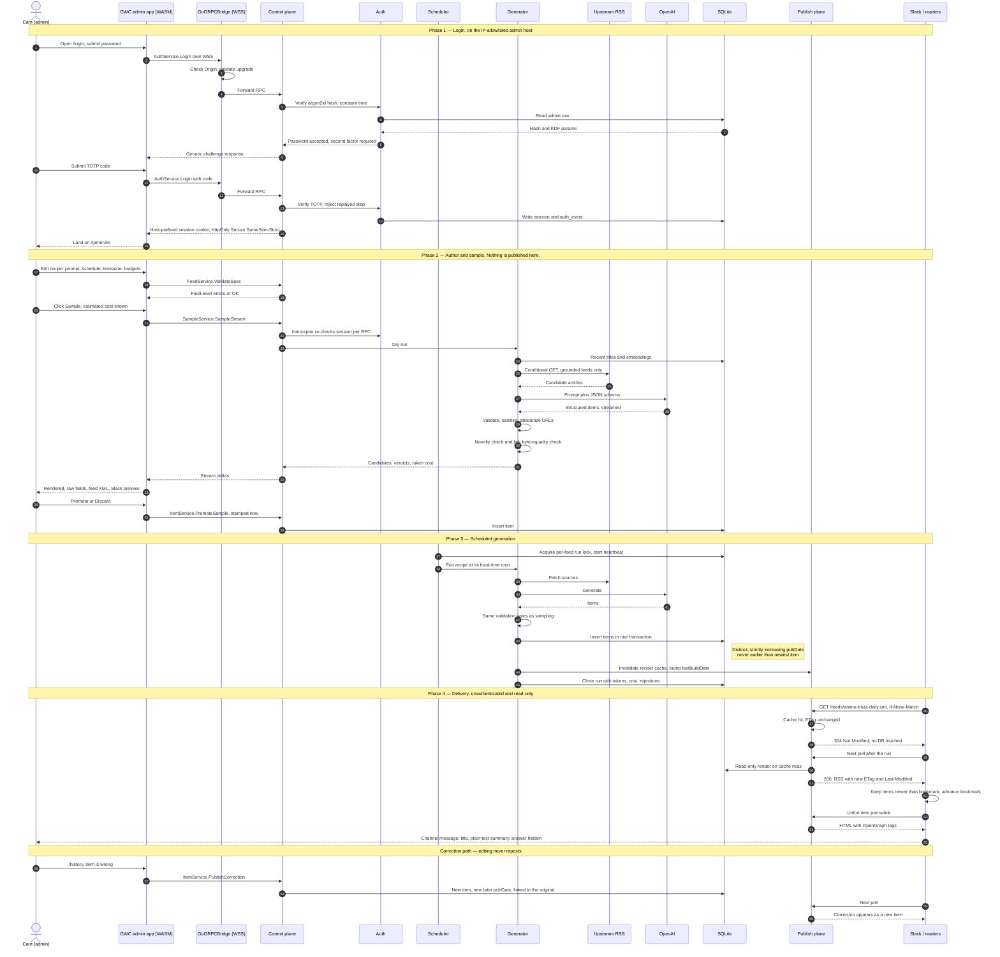

# AnimeFeedFlux — Plan

## 1. The bet

Any RSS reader can subscribe to a feed. Nothing stops that feed from being *written on demand*.
AnimeFeedFlux is a feed **generator**: you declare a recipe ("a daily anime trivia question",
"today's anime news, ranked"), it runs on a schedule, calls an LLM, and publishes the result at a
stable URL as spec-compliant RSS/Atom/JSON Feed. The consumers are Slack and any reader — including
ArticleFlux, which becomes a front end for free.

The product surface is: **a URL that returns valid XML and never lies.**

Two item classes, with different rules. Conflating them is the main way this project fails.

- **Generative** (trivia, fact-of-the-day, "on this day in anime"). The LLM *is* the source.
  Content is authored by us, hosted by us, permalinked to us. Risk = repetition and wrong facts.
- **Grounded** (news, releases, seasonal roundups). The LLM is only an editor. Every link must
  resolve to a real article we fetched ourselves. Risk = hallucinated URLs, handled architecturally
  rather than by prompting.

## 2. Two planes (the architectural spine)

"gRPC, no HTTP" holds for the *application*, but it cannot hold for the feeds themselves — RSS
clients speak HTTP/XML and nothing else. So the system splits in two, and the split is the security
boundary:

| | **Publish plane** | **Control plane** |
|---|---|---|
| Transport | Plain HTTPS, `GET`/`HEAD` only | gRPC over WebSocket (GoGRPCBridge) |
| Payload | RSS 2.0 / Atom 1.0 / JSON Feed 1.1 | protobuf |
| Client | Slack, any feed reader, unauthenticated | GWC WASM admin app, authenticated |
| Host | `anime.earlcameron.com` | `admin.anime.earlcameron.com`, IP-allowlisted |
| Writes | none — structurally impossible | all of them |
| Process | same binary, separate listener + mux | same binary |

There is **no REST/JSON API**. The publish plane serves a fixed route set (§6) and holds a
**read-only** store handle — a `*sql.DB` opened against a connection string with `mode=ro`, wrapped
in a reader interface with no write methods. Everything mutable — recipes, prompts, manual runs,
item edits, the kill switch — is an RPC. A bug in the publish plane cannot corrupt the database
because that code path has no writer, not because we were careful.

### 2.1 End-to-end flow

The whole system in one pass: admin logs in, authors and samples a recipe, the scheduler generates,
and the feed is delivered to Slack. Note where the two planes meet — they never talk to each other
directly, only through SQLite and a cache invalidation.



Two things the diagram is meant to make obvious. First, the publish plane never calls the control
plane and never writes — it reads SQLite and a cache, which is why an internet-facing bug cannot
corrupt data. Second, the Slack lane at the bottom is the reason for the `pubDate` discipline in
§5.5: its bookmark advances past anything it has seen, so a backdated item is delivered to nobody.

## 3. Stack

Standard earlcameron shape, so the ops story is boring:

- **UI:** GoWebComponents (pin v5, per the existing `earlcameron` pin) compiled to WASM. Admin only.
- **Transport:** GoGRPCBridge — gRPC-over-WebSocket, so the WASM client speaks real gRPC. Watch the
  known keepalive/GOAWAY flap: pair client keepalive with server `EnforcementPolicy` explicitly.
- **Backend:** Go, `net/http` for the publish listener, `grpc-go` behind the bridge for control.
- **Store:** SQLite, single file, `WAL`, `busy_timeout=5000`, `foreign_keys=ON`,
  `synchronous=NORMAL`. FTS5 registered (it needs an explicit build tag / registration — a known
  trap) for item search in the admin UI.
- **LLM:** `internal/llm` provider interface; the only v1 implementation is the official OpenAI Go
  SDK (`github.com/openai/openai-go`), using structured outputs (JSON schema) and embeddings.

### Layout

```
proto/aff/v1/            auth, feed, item, run, sample, system  (buf → gen/)
cmd/animefeedflux/       server: publish listener + bridge listener + scheduler
cmd/aff/                 CLI (gRPC client — same API as the UI, no back door)
internal/auth/           argon2id, sessions, TOTP, recovery codes, rate limiting
internal/config/         env parsing + validation, one struct, no globals
internal/store/          SQLite schema, migrations, reader/writer split, FTS5
internal/feedspec/       recipe validation, prompt templates, cron+timezone
internal/llm/            Provider interface, retry/backoff, cost accounting
internal/llm/openai/     the one v1 implementation
internal/generate/       generators: trivia, fact, onthisday, news
internal/sources/        upstream feed fetch, parse, conditional GET, URL verification
internal/render/         RSS 2.0 / Atom 1.0 / JSON Feed 1.1 serializers + permalink HTML
internal/scheduler/      cron loop, single-flight, injectable clock
internal/publish/        the read-only HTTP plane + render cache
internal/rpc/            gRPC service implementations + auth interceptor
internal/obs/            structured logging, metrics, staleness watchdog
web/                     GWC admin app (WASM) + shell
migrations/              NNNN_name.sql, forward-only
testdata/                golden feeds, canned LLM responses, canned upstream RSS
```

## 4. Security and authn

Single human user, who is the admin. **No authorization model** — one role, everything or nothing.
That makes authentication the entire defense, so it gets built properly rather than sketched.

- **Credential:** password hashed with **argon2id** (not bcrypt — no 72-byte truncation, memory-hard
  params tunable), stored in SQLite. Parameters recorded alongside the hash so they can be raised
  later and rehashed on next successful login. Verification is constant-time. No default password;
  the account is created by `aff admin init`, reading from stdin, refusing weak passphrases.
- **Second factor: TOTP (RFC 6238), required, not optional.** With a single admin and a public
  droplet, a leaked password otherwise loses everything. ±1 step drift window; **used (code, step)
  pairs are recorded and rejected on replay**. Recovery codes generated once at enrollment, shown
  once, stored hashed. TOTP secret encrypted at rest with a key derived from an env-supplied secret,
  so a stolen DB file alone is not a second factor.
- **Sessions:** 256-bit random token, hashed at rest, delivered as `HttpOnly; Secure;
  SameSite=Strict` cookie scoped to the admin host, `__Host-` prefixed. Absolute lifetime 12h, idle
  timeout 60m, rotation on login and on privilege change.
- **Bridge auth:** the WebSocket upgrade validates the session cookie *and* checks `Origin` against
  an allowlist. Every RPC additionally passes the session through a server interceptor — no
  "authenticated at upgrade, trusted forever". Session revocation kills in-flight streams.
- **CSRF:** `SameSite=Strict` plus `Origin` checking on the upgrade. gRPC-over-WS is not
  form-submittable, which removes the classic vector, but the `Origin` check is what actually closes
  it and is non-optional.
- **Network:** the admin listener binds its own port behind Caddy with an IP allowlist (home IP,
  same pattern as the droplet SSH rule). The publish listener is the only thing open to the world,
  and it is read-only and unauthenticated by design.
- **Login hardening:** per-IP and per-account exponential backoff, one generic failure message,
  uniform timing on unknown-user vs bad-password (always run the KDF), everything logged to
  `auth_events`.
- **Secrets:** `OPENAI_API_KEY` and `AFF_SECRET_KEY` from the environment (systemd
  `EnvironmentFile`, mode 0600), never in the DB, never in a recipe, never logged. A redaction
  filter on the log writer scrubs anything matching known key shapes, as a backstop rather than a
  primary control.
- **Untrusted input:** LLM output and upstream RSS are both hostile input. Sanitize HTML through a
  strict allowlist before storage, escape again at render, and never interpolate model text into XML
  or HTML without going through the encoder. Upstream XML parsing disables entity expansion (billion
  laughs) and caps body size.
- **Supply chain:** dependencies pinned, `go.sum` committed, `govulncheck` in CI.

Explicitly out of scope: roles, per-feed permissions, OAuth, user management, invite flows, audit
log export.

## 5. Feed specification compliance

Researched against the RSS 2.0 spec, the RSS Advisory Board's Best Practices Profile, RFC 4287, and
JSON Feed 1.1. These are implementation requirements, not aspirations, and each gets a golden test.

### 5.1 RSS 2.0

- `channel` **requires** `title`, `link`, `description`. We also emit `language`, `pubDate`,
  `lastBuildDate`, `generator`, `docs`, `ttl`, and `atom:link rel="self"`.
- `item`: the spec says *all* item elements are optional but **at least one of `title` or
  `description` must be present**. We always emit both, plus `guid`, `pubDate`, `link`.
- **`guid`**: `isPermaLink` **defaults to `true`** — a silent default that bites people. We emit an
  explicit `isPermaLink="false"` and use a **Tag URI**
  (`tag:anime.earlcameron.com,2026:<slug>/<hash>`), which the Best Practices Profile endorses. A
  guid must be stable forever, and neither our permalink scheme nor an upstream article URL is
  guaranteed stable. The human-facing permalink lives in `link`, where it belongs.
- **Dates**: RFC 822 with **four-digit years**, UTC only — `Thu, 04 Oct 2007 23:59:45 +0000`. No
  military timezone abbreviations, no double spaces, no comments. One formatter, used everywhere,
  unit-tested against the profile's examples.
- **Escaping**: plain-text elements use **hexadecimal character references** (`&#x26;`, `&#x3C;`),
  which the profile found more widely supported than named entities. HTML-bearing elements
  (`content:encoded`) use CDATA, with `]]>` in content split across sections. **No relative URLs
  anywhere** — RSS has no base-URL mechanism, so every href is absolutized before storage.
- `content:encoded` (`http://purl.org/rss/1.0/modules/content/`) carries the full item HTML, with
  `description` **ordered first** in the item, per the profile. See §5.5 for why `description` is
  plain text.
- Channel `image`, if used: max 144×400 px, requires `url`/`title`/`link`.
- `atom:link rel="self"` carries `type="application/rss+xml"` and the absolute feed URL.

### 5.2 Atom 1.0 (RFC 4287)

- `feed` MUST have exactly one `id`, `title`, `updated`, and MUST have `author` unless every entry
  carries its own. `entry` MUST have exactly one `id`, `title`, `updated`.
- `id` MUST be an IRI created so as to be unique, and consumers compare it
  **character-by-character, case-sensitively** — so it is the same Tag URI as the RSS guid,
  byte-identical, not a re-derivation.
- Dates are **RFC 3339** with an uppercase `T` separator and uppercase `Z` absent a numeric offset.
  This is a *different* format from RSS's RFC 822; two formatters, never crossed, and a test asserts
  neither function can produce the other's output.
- An entry with no `content` MUST carry `link rel="alternate"`. We always emit both.
- `feed` SHOULD carry `link rel="self"`.
- `summary` is plain text (`type="text"`); `content` is `type="html"`.

### 5.3 JSON Feed 1.1

- `version` is exactly `https://jsonfeed.org/version/1.1`; `title` is the only other required
  top-level field. We also emit `home_page_url`, `feed_url`, `description`, `language`, `authors`,
  `icon`, `favicon`.
- Each item **requires `id` as a string** (the Tag URI again) and **at least one of `content_html`
  or `content_text`**. We emit `content_html`, plus `url`, `title`, `summary`, `date_published`,
  `tags`.
- 1.1 replaced `author` with an `authors` array; `author` is deprecated. Emit `authors` only.
- `date_published` / `date_modified` are RFC 3339 — the same formatter as Atom.
- Served as `application/feed+json`.

### 5.4 Transport

- `Content-Type: application/rss+xml; charset=utf-8`, `application/atom+xml; charset=utf-8`,
  `application/feed+json` — never `text/xml`.
- XML declaration with explicit `encoding="utf-8"`; UTF-8 output; **no BOM**.
- **Conditional GET is mandatory.** Strong `ETag` (hash of the exact rendered body) plus
  `Last-Modified`; honor `If-None-Match` and `If-Modified-Since` with `304`. Readers poll
  relentlessly and a 304 must not touch SQLite, let alone the LLM.
- `Cache-Control: max-age=900`, gzip (pre-compressed and cached alongside the plain body),
  `<ttl>15</ttl>` — consistent numbers, not three independent guesses.
- `HEAD` behaves as `GET` minus the body, including validators.
- Feed window capped (default 50 items / 512 KB hard ceiling); older items stay in the DB and remain
  reachable at their permalinks.

### 5.5 Slack as a first-class consumer

Slack's native RSS app (`/feed subscribe`) is a primary target, and it is **stricter than the RSS
spec**. Spec-valid is not sufficient. Its documented behavior imposes four hard requirements:

1. **Every item needs a supported date tag.** No `pubDate`, no post.
2. **Items must not be listed out of sequence.** The feed is emitted strictly newest-first by
   `pubDate`, always.
3. **Duplicate dates are not allowed.** This is a live bug for us: a grounded news run publishing
   three items in one pass would naturally stamp them identically, and Slack would drop all but one.
   **Every item in a run gets a distinct, strictly increasing `pubDate`** (base + N seconds, ordered
   by the model's ranking), and the store enforces `UNIQUE(feed_id, published_at)` — a constraint,
   not a convention.
4. **The feed must validate.** Slack's own troubleshooting advice is to run it through the W3C
   validator. The `make validate` gate stops being cosmetic and becomes a compatibility requirement.

**The bookmark model drives everything else.** Slack stores the date of the last item it retrieved
and, on the next poll, fetches only items dated *later* than that bookmark. Consequences:

- **Never backdate.** A backfilled or hand-created item stamped at or before the current newest item
  is invisible to Slack forever. The admin UI blocks it by default and warns loudly on override;
  `PromoteSample` always stamps *now*.
- **Editing does not repost.** The guid and `pubDate` are unchanged, which is correct behavior and
  reinforces §12.4: if a published item is wrong, publish a correction. A correction is a *new* item
  with a *new, later* `pubDate` — it will not appear otherwise.
- **Deleting reaches nobody.** Slack already posted the message; removing the item from the window
  changes nothing in the channel.

**Rendering, and what it changes about the item template.** Slack posts the title as a link plus a
description snippet and does not render rich HTML — an HTML-heavy `description` degrades into a
dense, truncated block. So the template splits by consumer rather than optimizing for one:

- **`description`** — a short **plain-text** summary (target ≤ 300 chars, hard cap 500), no markup,
  special characters as hex references. This is what Slack shows, and the only thing many consumers
  show.
- **`content:encoded`** — the full HTML body, for readers that want it, ordered after `description`.

`summary_text` is therefore a first-class generated field, not a derived truncation of the body. The
model produces it directly, so it reads as a summary rather than a severed first paragraph.

**Trivia gets a specific benefit from this split.** Slack has no spoiler mechanism, so the answer
must never appear in `description` or every question is spoiled in the channel. Therefore:
`description` = the question only; the answer lives in `content:encoded` behind a spoiler break and
on the permalink page, with the link reading as "reveal the answer". The generation schema already
separates `answer_html`, so the renderer enforces this — it is not left to the prompt.

**Link unfurling.** Slack unfurls the item's `link`, so the permalink page carries OpenGraph and
`twitter:card` tags — `og:title`, `og:description` (the same plain-text summary), `og:image`
(per-feed default), `og:type=article`, `article:published_time`. Without these the unfurl is a bare
URL. For trivia, `og:description` is the question, never the answer.

**Practical check:** a private Slack workspace subscribes to the staging feed as part of M13. Slack
is the one consumer whose failure mode is silent — it simply never posts — so it gets an explicit
verification step rather than an assumption.

### 5.6 Verification

`make validate` renders the golden files and runs them through the W3C / RSS Advisory Board feed
validator; CI asserts zero errors *and* zero warnings for RSS, Atom, and JSON Feed. Goldens include
the ugly cases: ampersands, `<` in titles, CJK, emoji, `]]>` in body HTML, a 500-char summary, an
item with no link.

A dedicated **Slack-compatibility test** asserts: strictly descending unique `pubDate`s; every item
dated and parseable; `description` plain text under the cap; no answer text in `description` or
`og:description`; OG tags present on the permalink page.

## 6. Publish plane

Routes, and nothing else:

```
GET/HEAD  /                       feed index (HTML) + <link rel="alternate"> autodiscovery
GET/HEAD  /feeds/{slug}.xml       RSS 2.0
GET/HEAD  /feeds/{slug}.atom      Atom 1.0
GET/HEAD  /feeds/{slug}.json      JSON Feed 1.1
GET/HEAD  /items/{guid-hash}      permalink page (OG tags, answer reveal for trivia)
GET       /healthz                liveness + per-feed staleness
GET       /robots.txt             allow the index and permalinks, disallow nothing important
GET       /favicon.ico
```

Hardening, because this is the only thing exposed to the internet:

- Read/write/idle timeouts and `MaxHeaderBytes` set explicitly; no default-`http.Server`.
- Per-IP token-bucket rate limit, generous enough for honest polling (a reader hitting a 15-minute
  TTL is nowhere near it) and low enough to make hammering pointless. 429 with `Retry-After`.
- Any method other than `GET`/`HEAD` → `405` with `Allow`.
- Unknown slug → `404`; soft-deleted item → **`410 Gone`**, which is the semantically correct code
  and tells crawlers to forget it.
- Disabled feed → still serves its last built content (subscribers should not see a hole), with
  generation stopped. A *deleted* feed → `410`.
- Responses come from an in-memory render cache keyed by slug+format, holding body, gzip body,
  ETag, and Last-Modified. A cache hit never touches SQLite. Cache is invalidated on write by the
  control plane, and rebuilt lazily.
- No stack traces, no version banner, no directory listing, no server header beyond a static one.

## 7. Recipes

With an admin UI editing prompts, **SQLite is the source of truth** for recipes. TOML
import/export (`aff recipe export|import`) exists for versioning and disaster recovery, not as the
live path.

A recipe carries: slug, title, description, language, kind (`generative` | `grounded`), schedule,
items per run, retention window, model params, system and user prompt templates, novelty settings,
per-day token and run budgets, and — for grounded feeds — one or more source URLs.

**Scheduling and time zones.** Cron alone is a trap here: "daily trivia at 7am" means 7am *local*,
and a UTC cron silently shifts by an hour twice a year. Each recipe stores a cron expression **plus
an IANA timezone** (`America/New_York`), and the scheduler evaluates in that zone. Documented
behavior for DST: a run scheduled in the skipped hour fires at the next valid instant; a run in the
repeated hour fires **once**, tracked by a per-feed `last_fired_slot` so the ambiguous hour cannot
double-fire. The UI shows the next three runs in local time as a readback.

**Prompt template variables**, available in both templates and listed inline in the editor:

```
{{.Today}}          date in the feed's timezone, YYYY-MM-DD
{{.Weekday}}        e.g. "Tuesday"
{{.Season}}         "Winter 2026" — the anime season for .Today
{{.FeedTitle}}
{{.ItemsPerRun}}
{{.RecentTitles}}   the exclusion list (generative)
{{.Candidates}}     fetched source articles: title, url, published, excerpt (grounded)
```

Templates are `text/template` with a **strict missing-key policy** — an unknown variable is a
validation error at save time, not an empty string at 4am. Rendered prompts are hashed and stored on
each item (`prompt_hash`) so a quality change can be traced to the prompt that caused it.

Validation runs server-side in the RPC (the UI's copy is a convenience, never the gate): slug
URL-safe and unique, cron parses, timezone resolves, templates compile with known variables only,
grounded implies ≥1 source, budgets non-zero, items-per-run within bounds. An invalid recipe
disables that feed alone and never takes the server down.

## 8. LLM provider abstraction

One interface, one v1 implementation. The abstraction exists so the OpenAI SDK's types never leak
past `internal/llm/openai` — not because a second provider is planned.

```go
type Provider interface {
    Name() string
    Generate(ctx context.Context, req GenerateRequest) (GenerateResult, error) // JSON-schema constrained
    Stream(ctx context.Context, req GenerateRequest) (iter.Seq2[Delta, error], error)
    Embed(ctx context.Context, texts []string) ([][]float32, error)
    Pricing() PriceTable
}
```

`GenerateResult` carries the parsed items, raw JSON, token counts, model id, and finish reason.

**Error taxonomy**, because "the API failed" is not actionable at 4am. Every provider error maps to
one of: `Transient` (429, 5xx, timeout, connection reset) → retry with exponential backoff and
jitter, honoring `Retry-After`, capped at 3 attempts; `Invalid` (schema violation, refusal, truncated
output) → one repair attempt with the validation error fed back, then fail the run; `Fatal` (auth,
quota exhausted, model not found) → fail immediately, disable generation, and surface it on
`/healthz` and the dashboard rather than retrying into a wall. Context-length overflow is its own
case: shrink `{{.Candidates}}` / `{{.RecentTitles}}` and retry once.

Every call is wrapped in a context timeout and its outcome recorded on the run.

**Embeddings.** A small embedding model, dimension recorded per row so a model change is detectable
rather than silently comparing incompatible vectors. Vectors are stored L2-normalized so similarity
is a dot product. Brute-force comparison over the last 500 items is microseconds — **no vector index
is needed and adding one would be premature**. A model change invalidates the embedding set and
triggers a background re-embed.

## 9. Generation contract

Every generator returns the same shape, enforced by JSON-schema structured output on the model call
and then **re-validated in Go** — never trust the model to honor its own schema.

```
Item {
  title         required, 10..200 chars, no trailing punctuation
  summary_text  required, PLAIN TEXT, ≤300 target / 500 hard  → description, og:description
  body_html     required, allowlist-sanitized (p, em, strong, a, ul, li, blockquote, code)
  link          optional for generative, REQUIRED for grounded
  source_name   grounded only
  tags          0..6, lowercase, from a controlled vocabulary where possible
  answer_html   trivia only — never surfaced in summary_text (§5.5)
}
```

Per run:

1. **Acquire context.** Generative: the last N item titles as an exclusion list. Grounded: fetch all
   sources (conditional GET against *them* too, storing their ETag/Last-Modified), parse, keep
   entries newer than the last run, cap at ~40 candidates.
2. **Call the model** with structured output. Record tokens in/out, model, and cost on the run.
3. **Validate** against the Go schema. Malformed output → one repair attempt (§8), then fail.
4. **Sanitize** HTML through the allowlist; absolutize every URL; strip tracking parameters
   (`utm_*`, `fbclid`) from links so the same article is not two different URLs.
5. **Novelty check** (generative): embed `title + summary_text`, compare against the last 500
   embeddings, cosine above threshold → discard and retry up to N times, then skip the run and log
   it. Repetition is what kills a daily trivia feed, and prompting alone will not prevent it at 200
   items.
6. **Link integrity** (grounded): the item's `link` MUST be byte-equal (after normalization) to a URL
   in the fetched candidate set. Not "similar to" — present. Failures are dropped and counted.
   Optional second check: `GET` returns 200 with a non-empty title.
7. **Persist** with the Tag URI guid from `sha256(slug | normalized_title | date)`, assigning each
   item a **distinct, strictly increasing `published_at`** never earlier than the feed's current
   newest (§5.5).
8. **Invalidate** the render cache for that slug; bump `lastBuildDate`.

Steps 3–8 run in a single transaction from the store's perspective: a run either adds its items or
adds none. Failure is always "the feed keeps its previous items and logs an error run" — never a
partial feed, never an invented link.

## 10. Data model

```
schema_migrations(version, applied_at)

admin(id, password_hash, kdf_params, totp_secret_enc, created_at, password_changed_at)
recovery_codes(id, code_hash, used_at)
totp_used(step, code_hash, at)              -- replay prevention
sessions(id, token_hash, created_at, last_seen_at, expires_at, ip, user_agent, revoked_at)
auth_events(id, at, kind, ip, ok, detail)

settings(key PRIMARY KEY, value)            -- singleton config editable at runtime (§12.5)

feeds(id, slug UNIQUE, title, description, language, kind, spec_json, enabled,
      timezone, last_fired_slot, last_built_at, deleted_at, created_at, updated_at)
items(id, feed_id, guid UNIQUE, title, summary_text, body_html, answer_html, link,
      source_name, published_at, model, prompt_hash, tokens_in, tokens_out, run_id,
      origin, created_at, updated_at, edited_at, deleted_at)
      -- origin: generated | sampled | manual | correction
      -- deleted_at is a SOFT delete: the guid is never freed, the permalink 410s
      -- UNIQUE(feed_id, published_at) — Slack drops items sharing a timestamp (§5.5)
      -- summary_text is PLAIN TEXT (→ description, og:description); body_html → content:encoded
items_fts(title, summary_text, body_html)   -- FTS5 external-content, synced by trigger
item_revisions(id, item_id, at, field, old_value, new_value)
item_embeddings(item_id, model, dim, vec BLOB)
corrections(item_id, corrects_item_id)      -- links a correction to what it corrects
runs(id, feed_id, started_at, finished_at, status, error_kind, error, items_added,
     items_rejected, reject_reasons_json, tokens_in, tokens_out, est_cost_usd,
     trigger, lock_holder, heartbeat_at)    -- trigger: cron | manual | sample | backfill
samples(id, feed_id, created_at, expires_at, payload_json, tokens_in, tokens_out, cost_usd)
sources(id, feed_id, url, kind, last_fetched_at, last_etag, last_modified, last_status)
```

`runs` is the operational spine — cost, drift, and "why is this feed stale" all resolve there, and
it is the first screen of the history page. `heartbeat_at` plus `lock_holder` is how a crashed run
is detected and reclaimed (§14).

Migrations are forward-only numbered SQL files applied at boot inside a transaction, with the
version recorded. No down-migrations: the recovery path is a backup restore, which is honest about
what would actually happen.

## 11. Control-plane API (proto sketch)

- `AuthService`: `Login` (password + TOTP), `RecoverWithCode`, `Logout`, `Session`,
  `ChangePassword`, `ListSessions`, `RevokeSession`, `RevokeAllSessions`, `ReenrollTOTP`,
  `RegenerateRecoveryCodes`.
- `FeedService`: `List`, `Get`, `Create`, `Update`, `SetEnabled`, `Delete`, `RunNow`,
  `ValidateSpec`, `ExportTOML`, `ImportTOML`.
- `SampleService`: `Sample` (unary dry run), `SampleStream` (server-stream), `ListSamples`,
  `DiscardSample`.
- `ItemService`: `List` (search/filter/paginate), `Get`, `Create`, `Update`, `Delete`, `Restore`,
  `PurgeDeleted`, `PromoteSample`, `PublishCorrection`.
- `RunService`: `History`, `Get`, `Watch` (server-stream of live progress), `Delete`.
- `SystemService`: `Stats`, `SetGenerationEnabled`, `GetSettings`, `UpdateSettings`, `Version`,
  `Backup`.

Conventions: every mutation takes an `expected_version` for optimistic concurrency (two browser tabs
must not silently clobber a recipe — a lesson already paid for in CashFlux); list RPCs paginate with
an opaque cursor; errors use gRPC status codes with a machine-readable detail so the UI can render
against the offending field.

`Sample` is the important one: a full dry run returning the items it *would* publish, the rendered
XML fragment, the novelty verdict, the grounded-link verdicts, and measured cost — writing nothing
except a `samples` row. That is the loop for iterating prompts and what keeps spend down. The CLI is
a gRPC client against these same services — no privileged back door that bypasses auth or
validation. `aff admin init` and `aff admin reset` are the only local-only commands, and they
require filesystem access to the DB.

## 12. Admin UI (GWC)

Five pages. Two unauthenticated, three behind the session.

```
/login       unauthenticated
/recover     unauthenticated
/generate    default landing page after login
/history
/settings
```

Client-side routing in WASM needs a correct `<base href>` in the shell — without it deep links and
refreshes break, which has bitten the other Flux apps. The shell is the only HTML in the project.
The WASM bundle is served pre-compressed (`.wasm.gz`) with the right `Content-Encoding`.

### 12.1 Login (`/login`)

Single form, two steps, one page: password, then TOTP code. Deliberately plain.

- One generic error string for every failure — wrong password, unknown state, bad code. Never
  "invalid code" vs "invalid password"; that difference is an oracle.
- Backoff surfaced honestly ("try again in 30s"), not silently swallowed submits.
- Submit disabled while in flight; no double-submit burning a TOTP window.
- Link to `/recover`. No "remember me" — session lifetimes are fixed in §4.
- On success, replace history state so Back does not land on a stale login form.
- Works without JS-dependent niceties: it is the one page that must never break.

### 12.2 Recovery (`/recover`)

Worth being blunt about the constraint: one admin, no second human, and **no email
infrastructure**. "Email me a reset link" does not exist, and pretending otherwise would leave a
dead end at the worst possible moment. Recovery is exactly two paths, and the page says so:

1. **Recovery code** — the single-use codes from enrollment. Consumes the code, opens a short-lived
   (10 min) elevated session that can *only* reach "set new password" and "re-enroll TOTP", then
   forces a full re-login and revokes every other session. Used codes are marked, never reusable,
   and the remaining count is shown afterwards. At ≤2 remaining, the dashboard nags.
2. **Break-glass on the box** — `aff admin reset` over SSH, requiring local DB access. The page
   states this plainly so a locked-out future me knows the answer immediately.

Same generic-error and backoff rules as login. Recovery attempts land in `auth_events` and are the
one event worth alerting on if a notification channel is ever configured.

### 12.3 Generation (`/generate`)

The main working surface: pick or create a feed, edit its recipe, **sample it**, publish. Three
panes — rail, editor, sampler.

- **Rail** — feeds with status, last build, next run (local time), item count, 7-day spend; enable
  toggle, Run Now, new feed. A stale feed (§14) is flagged here, not buried in a log.
- **Editor** — slug, title, description, language, kind, cron **plus timezone** with a plain-English
  readback and the next three runs in local time, model and params, system and user prompt templates
  with the variable list inline, novelty settings, budgets, and sources for grounded feeds.
  Validation errors come from `ValidateSpec` and render against the offending field. Unsaved-changes
  guard on navigation.
- **Sampler** — the part that matters. "Sample this query" runs the full generation pipeline against
  the live provider and **writes nothing**:
  - sample size 1–5, optional temperature override for the run;
  - streams output as it arrives (`SampleStream`) rather than staring at a spinner, with cancel;
  - shows each candidate three ways — **rendered** (as a reader displays it), **raw fields** (the
    validated JSON), and **feed XML** (the exact `<item>` that would be emitted);
  - a **Slack preview** approximating the Slack card — title link plus the plain-text summary, so
    the thing that actually gets read is the thing being reviewed, and a trivia answer leaking into
    the summary is visible immediately;
  - runs the real novelty check and shows the verdict with the nearest existing item, so repetition
    is caught *before* publishing;
  - for grounded feeds, shows the candidate source set and flags any link failing the byte-equality
    check, with the failing URL;
  - reports tokens and estimated cost per sample, and the day's remaining budget;
  - **Promote** persists a chosen sample as a real item (`origin = sampled`, stamped *now*);
    **Discard** drops it. Nothing is published implicitly by sampling.
  - Samples persist server-side for 24h, so a good one survives a refresh.

Sampling is billable, so the button always shows the estimated cost, and the kill switch disables it
with a visible reason rather than leaving a dead control.

### 12.4 History (`/history`)

Two tabs over one page, because "history" means both things and they answer different questions.

**Runs** — every attempt: status, trigger, duration, items added/rejected with reasons, tokens,
cost, error kind. Filter by feed, status, date range. Rows expand to the full log; in-flight runs
stream via `Watch`. Runs support **delete** (pruning noise) but not edit — a run records something
that happened, and editing it would make the cost and drift numbers lie.

**Items** — every published item, full CRUD:

- **Create** — hand-author an item (`origin = manual`).
- **Read** — FTS5 search plus filters on feed, origin, date range, deleted state; paginated.
- **Update** — title, summary, body, link, tags, publish date. **The guid never changes on edit.**
  Deliberate: a stable guid makes readers update in place, whereas a new guid resurfaces the item as
  a duplicate in every subscriber's inbox. Edits are recorded in `item_revisions` (with a diff view
  and revert) and bump `lastBuildDate`. Changing `published_at` is guarded by the no-backdating rule
  (§5.5).
- **Delete** — soft delete. The item leaves the feed window, its permalink returns **410 Gone**, and
  the guid is never reused. `Restore` undoes it; `PurgeDeleted` hard-deletes behind typed
  confirmation.
- **Publish a correction** — creates a new item linked to the original via `corrections`, stamped
  now, prefixed "Correction:", and rendered with a pointer back. This is the only mechanism that
  actually reaches subscribers.
- Bulk select for delete/restore, for the obvious case of one bad run's output.

The UI states the thing people forget: **RSS has no retraction.** Deleting or editing only changes
what future fetches see; anyone who already pulled the item keeps their copy, and Slack keeps its
message. So "publish a correction" sits next to Delete, not three menus away.

Every mutation invalidates that feed's render cache and bumps `lastBuildDate`, so the published XML
and the admin view never disagree.

### 12.5 Settings (`/settings`)

- **Security** — change password (current password + TOTP), re-enroll TOTP, regenerate recovery
  codes with remaining count, active sessions with device/IP/last-seen and individual or global
  revoke.
- **Provider** — active provider, default model for new feeds, embedding model, key presence
  (status only — never displayed, never sent to the client, never editable here; it lives in the
  environment per §4), and the editable **price table** used for cost estimates, since published
  prices change and a stale table silently makes every cost number wrong.
- **Generation** — global kill switch, global daily token and spend ceiling, default per-feed
  budgets, retention and feed-window defaults, staleness threshold.
- **Publishing** — public base URL, feed author and contact, copyright line, default TTL and
  `Cache-Control`, default `og:image`. These land in every channel element, so they are validated
  (absolute URL, correct scheme) on save.
- **Data** — recipe TOML export/import, on-demand backup download, DB size and item counts, vacuum.
- **About** — version, build, uptime, last successful run per feed.

### 12.6 Conventions

GWC discipline as usual: hooks unconditional and positional, no `UseAtom` in render-only paths,
declared effect deps, no reading browser state from the render body. Responsive breakpoints land in
the same commit as the layout. Every destructive action (delete, purge, revoke all, regenerate
recovery codes) sits behind a `⋯` kebab rather than a primary button, and irreversible ones require
typed confirmation. Loading, empty, and error states are designed for every list — an admin tool
that shows a blank box on failure is how a stale feed goes unnoticed for a week. No i18n: single
user, English, explicitly out of scope.

## 13. Cost model and blast radius

- Estimates come from an editable price table (§12.5), multiplied by recorded token counts. Every
  run and every sample stores its own `est_cost_usd` at the price in force, so history stays
  meaningful after a price change.
- Per-feed daily token and run caps enforced **before** the call; exceeding logs a skipped run with
  a distinct status, visible on the dashboard rather than silent.
- A **global** daily spend ceiling on top of per-feed caps, because the failure mode is N feeds each
  individually within budget.
- Sampling draws from the same budget as scheduled generation — otherwise the safety net has a hole
  exactly where the interactive, easy-to-repeat action is.
- Global kill switch (`SetGenerationEnabled`, plus `AFF_GENERATION_ENABLED=0` for a cold start):
  existing feeds keep serving, nothing generates.
- Scheduler is single-flight per feed via a DB run lock with heartbeat, so a slow run cannot stack.
- `Sample` and the CLI's `--dry-run` never publish.

## 14. Operations

**Observability.** Structured JSON logs (`log/slog`) with a request/run id threaded through, secrets
redacted. `/healthz` returns per-feed last-success age, enabled state, error counts, and provider
status; it is the endpoint an external uptime checker watches.

**Staleness is the real failure mode.** A generator that silently stops is worse than one that
crashes — the feed just goes quiet, and nobody notices for a week. A watchdog compares each enabled
feed's last successful run against its schedule plus a grace factor and marks it **stale**: flagged
in the rail, red on `/healthz`, and (if configured) posted to a Slack webhook. Alerting on absence
of work, not just presence of errors, is the point.

**Backups.** The SQLite file is the only copy of everything ever generated. Nightly
`VACUUM INTO` snapshot to a timestamped file, retained 14 days, plus `SystemService.Backup` for an
on-demand download before anything risky. Restore is documented and **tested once during M14** —
an untested backup is not a backup. Local-only, consistent with how this box is treated.

**Deploy.** Built on the droplet (same pattern as ArticleFlux), which avoids cross-compilation
surprises. The WASM build runs in an isolated scratch directory to dodge the known concurrent-build
race, emits `.wasm.gz`, and the binary and assets are published by atomic move into the serve
directory so no request ever sees a half-written file. systemd unit with `Restart=always`,
`EnvironmentFile` at 0600, `NoNewPrivileges`, `ProtectSystem=strict`, and a writable path only for
the DB and backups. Caddy terminates TLS, serves both hosts, and applies the IP allowlist to the
admin host. Logs go to journald with rotation.

**Graceful shutdown.** SIGTERM stops the scheduler from starting new runs, lets in-flight runs
finish within a timeout (a partially-charged LLM call should not be wasted), drains HTTP and gRPC
connections, checkpoints WAL, and exits. Runs still active at the deadline are marked interrupted.

**Crash recovery.** Runs hold a lock row with a heartbeat. At boot, any run whose heartbeat is older
than the threshold is marked `interrupted` and its lock released, so a crash mid-generation does not
wedge a feed forever. Because generation commits atomically (§9), an interrupted run leaves no
partial items.

**Data growth.** Items are retained indefinitely by default (they are the archive and they are
small); embeddings are pruned beyond the comparison window; `runs` older than 180 days are pruned
except failures. A size figure on the settings page makes growth visible before it is a problem.

## 15. Configuration

Environment only — no config file, no secrets on disk beyond the systemd `EnvironmentFile`.

| Variable | Required | Purpose |
|---|---|---|
| `AFF_DB_PATH` | yes | SQLite file path |
| `AFF_PUBLIC_BASE_URL` | yes | absolute base for links, guids, `atom:link rel=self` |
| `AFF_PUBLISH_ADDR` | yes | publish listener bind address |
| `AFF_ADMIN_ADDR` | yes | control-plane listener bind address |
| `AFF_ALLOWED_ORIGINS` | yes | comma list for the WS `Origin` check |
| `AFF_SECRET_KEY` | yes | derives the TOTP-secret encryption key |
| `OPENAI_API_KEY` | yes | provider credential |
| `AFF_GENERATION_ENABLED` | no | cold-start kill switch, default `1` |
| `AFF_LOG_LEVEL` | no | default `info` |
| `AFF_BACKUP_DIR` | no | nightly snapshot destination |
| `AFF_SLACK_WEBHOOK_URL` | no | staleness/failure alerts |
| `AFF_LIVE_LLM` | no | test-only; enables paid provider tests |

Config is parsed and **validated at boot** — a missing or malformed required variable fails fast
with a clear message rather than surfacing as a broken feed hours later. The base URL is validated
as absolute with a scheme, since it is baked into every guid.

## 16. Testing

- `internal/llm` ships a `FakeProvider` replaying `testdata/*.json`. **The default test run never
  calls a paid API.** Live-provider tests are gated behind `AFF_LIVE_LLM=1` and excluded from CI.
- Upstream fetches served from `testdata/` through an injected `http.Client`.
- Golden-file tests for all three renderers, the permalink page, and the Slack-compatibility
  assertions (§5.6), plus the external validator in `make validate`.
- Scheduler tests use an injected clock — no sleeping. Explicit DST cases: the skipped hour and the
  repeated hour, asserting exactly one fire each.
- Migration tests: apply from empty, apply twice (idempotent), apply onto the previous release's
  schema with seeded data.
- Store tests: the `UNIQUE(feed_id, published_at)` constraint, soft-delete/restore/purge, FTS5
  trigger sync, optimistic-concurrency conflict.
- Auth tests: TOTP replay rejection, drift window edges, session expiry/rotation/revocation, backoff,
  timing uniformity, cookie flags, `Origin` rejection on the upgrade, recovery-code single use.
- Publish-plane tests: 304 on both validators, `HEAD` parity with `GET`, 405 on `POST`, 410 on
  deleted items, gzip correctness, rate-limit behavior, and a test asserting the read-only handle
  **rejects writes** — the §2 claim verified, not assumed.
- Adversarial generator tests, each of which must reject rather than publish: malformed JSON; a URL
  absent from the source set; a near-duplicate of yesterday; `<script>` in `body_html`; a relative
  URL in an anchor; a title containing `]]>`; a summary over the cap; an answer leaked into
  `summary_text`; a backdated `published_at`; two items in one run sharing a timestamp.
- Crash-recovery test: kill mid-run, assert the lock is reclaimed and no partial items exist.
- End-to-end: generate → publish → fetch the feed → assert the validator passes and the item appears
  exactly once across two consecutive polls.

## 17. Milestones

| # | Milestone | Done when |
|---|-----------|-----------|
| M0 | Skeleton | Module, layout, buf codegen, config validation, `/healthz`, CI green |
| M1 | Store | Schema, migrations, reader/writer split, FTS5, migration tests |
| M2 | Renderers | RSS/Atom/JSON + permalink page from seeded items; goldens pass |
| M3 | Compliance | External validator clean on all three; Slack-compatibility tests green |
| M4 | Publish plane | Conditional GET, HEAD, gzip, cache, 404/410/405, rate limit, read-only proof |
| M5 | Auth | argon2id + TOTP + recovery + sessions + backoff; `aff admin init`; tests green |
| M6 | Bridge + RPC | GoGRPCBridge wired, interceptor auth, Feed/System services, CLI client |
| M7 | Generative feed | Trivia + fact end-to-end on `FakeProvider`, then one real OpenAI run |
| M8 | Novelty | Embeddings, dedup, retry; 30-day simulated backfill yields no near-duplicates |
| M9 | Scheduler | Cron + timezone + DST, single-flight, budgets, run accounting, kill switch |
| M10 | Grounded news | Source fetch, candidate set, link-integrity enforcement, ranking prompt |
| M11 | Sampling | `Sample`/`SampleStream`, sample persistence, promote, cost reporting |
| M12 | Admin UI | Five GWC pages against real RPCs, responsive, empty/error states |
| M13 | Slack proof | Private workspace subscribes to staging; items post, no dupes, no spoilers |
| M14 | Ops | Backups + tested restore, staleness watchdog, graceful shutdown, crash recovery |
| M15 | Deploy | Caddy, systemd hardening, IP allowlist, `.wasm.gz`, feeds live |
| M16 | Integration | ArticleFlux subscribes; verify rendering, dedup, refresh behavior |

M1–M4 are plumbing and should land fast. M8 and M10 are the actual engineering. M5/M6 come before
anything is exposed, because that is where mistakes are expensive. M13 is deliberately before
deploy: discovering Slack drops your items after go-live is the expensive ordering.

## 18. Definition of done (v1)

1. Three feeds live: `anime-trivia-daily`, `anime-fact-daily`, `anime-news-daily`.
2. All three validate clean, in all three formats, with zero validator warnings.
3. Slack subscribes to all three; over a 7-day window every generated item posts exactly once, no
   duplicates, no missed items, no trivia answers visible in the channel.
4. Thirty consecutive days of trivia contain no near-duplicate pairs above the novelty threshold.
5. Every news item links to an article that resolves 200 — zero invented URLs, verified by an audit
   over the full item table.
6. Admin reachable only from the allowlisted IP, only with password + TOTP; a recovery-code drill
   has been performed successfully at least once.
7. Total monthly spend under the configured ceiling, with per-feed attribution in `runs`.
8. A backup has been restored into a scratch instance and serves identical feeds.

## 19. Risks

- **Repetition** in daily generative feeds. M8 mitigates, but embeddings only catch surface
  similarity; expect to add a topic-coverage ledger (series, decade, genre already used) later.
- **Wrong facts.** Trivia will sometimes be wrong and there is no cheap oracle. Mitigation: narrow
  claims, cite a source when the model can name one, a report link in the feed footer, and the
  correction mechanism (§12.4). A nonzero error rate is the honest expectation, not a bug to close.
- **Hallucinated links** — structurally prevented (§9.6), not prompted away.
- **Slack's silent failure mode.** It does not error; it simply stops posting. Hence the dedicated
  test suite, the Slack preview in the sampler, and M13 before deploy.
- **Bridge fragility.** gRPC-over-WS through Caddy is the least standard piece, and the
  keepalive/GOAWAY flap is a known failure. Budget real time for M6 and keep the CLI working as an
  independent check when the browser path misbehaves.
- **Model or pricing drift.** A model deprecation or price change silently degrades output quality
  or cost accuracy. Model id is pinned per recipe and recorded per item; the price table is editable.
- **Upstream ToS and fragility.** Summarize-and-link only, never republish full text; a source that
  changes format or dies must degrade the news feed, not break it.
- **Cost creep** — per-feed and global caps, sampling drawing from the same budget, tracked in `runs`.
- **Single point of failure.** One droplet, one SQLite file. Accepted for a personal project; the
  mitigation is backups that have actually been restored.

## 20. Open questions

1. **Which feeds ship first?** Assumption: `anime-trivia-daily`, `anime-fact-daily`,
   `anime-news-daily` (grounded). Confirm or swap.
2. **Are the published feeds public?** The plan assumes public read-only on
   `anime.earlcameron.com`, which is what makes §2's unauthenticated plane safe. Private feeds would
   need per-subscriber tokens in the URL and would change §5.4's caching. Note Slack can subscribe
   to a tokenized URL, so this is possible — just a different design.
3. **Grounded sources** — starting set is ANN + Crunchyroll News RSS. Others in or out?
4. **Posting cadence for the news feed** — one digest item per day, or N separate items? Separate
   items read better in Slack; a digest is cheaper and quieter. Assumption: 3 separate items.

## References

- [RSS 2.0 Specification](https://www.rssboard.org/rss-specification)
- [RSS Best Practices Profile](https://www.rssboard.org/rss-profile)
- [RFC 4287 — The Atom Syndication Format](https://datatracker.ietf.org/doc/html/rfc4287)
- [JSON Feed 1.1](https://www.jsonfeed.org/version/1.1/)
- [Add RSS feeds to Slack](https://slack.com/help/articles/218688467-Add-RSS-feeds-to-Slack)
- [RSS & Slack Integration — Slack Marketplace](https://slack.com/marketplace/A0F81R7U7-rss)
- [The Proper Content Type for XML Feeds](https://www.petefreitag.com/blog/content-type-xml-feeds/)
- [RSS Feed Best Practices — Kevin Cox](https://kevincox.ca/2022/05/06/rss-feed-best-practices/)
